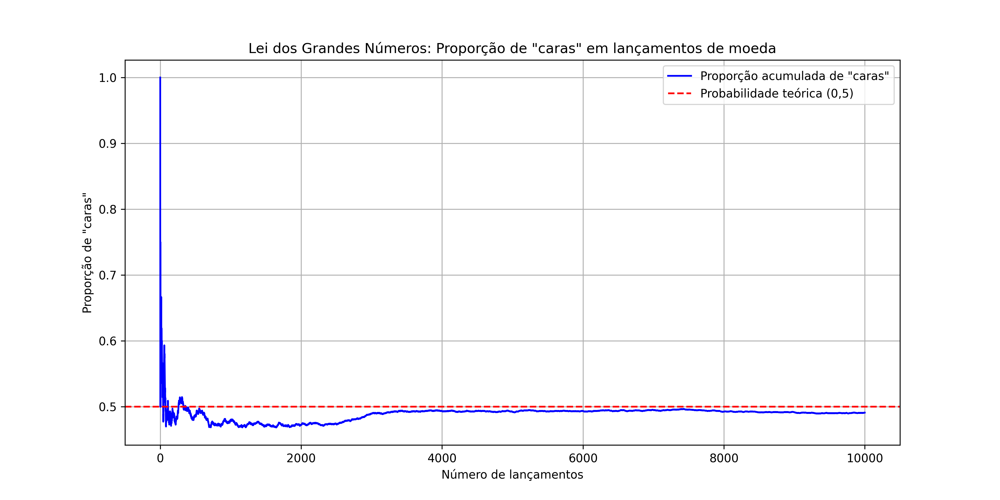
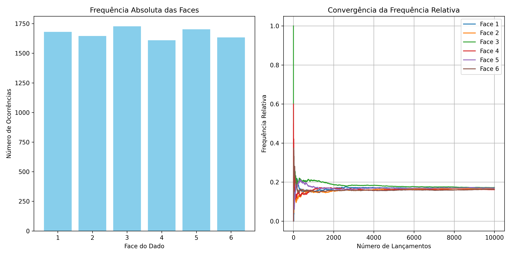

# **Introdução à Probabilidade**

A disciplina de **Probabilidade** é uma área da matemática que estuda fenômenos e situações em que o resultado é incerto. Diferente da matemática clássica, que lida com certezas, a probabilidade nasce da necessidade humana de entender, quantificar e prever o acaso.

### Um pouco da história

A história da probabilidade começa de maneira bastante prática: nas mesas de jogos de azar. Nos séculos XV e XVI, apostadores e nobres europeus buscavam entender as chances de ganhar em jogos de dados e cartas. Eles consultavam matemáticos para tentar "prever" resultados e, assim, melhorar suas estratégias. Um dos episódios mais marcantes aconteceu no século XVII, quando o nobre francês Chevalier de Méré procurou ajuda para resolver dúvidas sobre jogos de dados. Ele recorreu ao matemático **Blaise Pascal**, que trocou correspondências com **Pierre de Fermat** — essas trocas são consideradas o ponto de partida formal da teoria da probabilidade.

No século seguinte, **Jacob Bernoulli** escreveu o importante livro *Ars Conjectandi* ("A Arte da Conjectura"), onde estabeleceu bases teóricas mais sólidas para a área. Depois, **Pierre-Simon Laplace** aplicou a probabilidade a fenômenos naturais e sociais, dando um enorme impulso ao seu reconhecimento como uma ciência fundamental.

### A importância da probabilidade

Hoje, a probabilidade é crucial em diversas áreas do conhecimento e da vida cotidiana. Ela é a base da estatística, da ciência de dados, da inteligência artificial, da engenharia, da medicina, da economia, e de tantas outras disciplinas. 

No mundo moderno, usamos probabilidade para prever a previsão do tempo, calcular riscos de investimentos, desenvolver vacinas, criar algoritmos de recomendação em plataformas digitais e até entender o comportamento de partículas subatômicas na física quântica.

A probabilidade também é fundamental para o raciocínio em situações de incerteza. Em decisões empresariais, políticas públicas, diagnósticos médicos e até nas decisões individuais do dia a dia (como decidir se é melhor levar ou não um guarda-chuva), estamos, ainda que de maneira informal, fazendo uso da probabilidade.

### O que a disciplina aborda

A disciplina de probabilidade ensina a construir modelos para lidar com o acaso. Ela ajuda a responder perguntas como:
- Qual é a chance de um evento acontecer?
- Como diferentes eventos se relacionam?
- Como a incerteza se distribui ao longo de várias tentativas?

Sem entrar em fórmulas avançadas, a probabilidade começa com conceitos simples como o espaço amostral (o conjunto de todos os resultados possíveis) e eventos (subconjuntos do espaço amostral). A partir daí, desenvolve formas de calcular e interpretar a chance de cada evento.

Com o avanço da disciplina, surgem noções mais refinadas como variáveis aleatórias, distribuições de probabilidade, esperança matemática (uma espécie de "média ponderada" dos resultados possíveis), e muitos outros conceitos que são essenciais para entender como o mundo funciona sob incerteza.

A probabilidade é uma das ferramentas mais poderosas que a humanidade desenvolveu para entender o desconhecido. Nascida do jogo e da curiosidade, ela evoluiu para ser um pilar da ciência moderna. Com ela, aprendemos que nem tudo precisa ser certo para ser estudado de maneira rigorosa — o que, de certa forma, aproxima a matemática da própria experiência humana, que é cheia de surpresas e incertezas.

---

### A evolução da probabilidade como ciência

Após o trabalho inicial de Pascal e Fermat, a probabilidade ganhou espaço como uma disciplina matemática autônoma. No século XVIII, **Abraham de Moivre** introduziu ideias que hoje são centrais, como a aproximação de eventos raros usando a curva normal (o famoso “formato de sino”), um conceito que mais tarde seria explorado por Gauss na estatística.

No século XIX, a probabilidade começou a se consolidar como parte essencial da formação científica. Ela deixou de ser apenas uma curiosidade ligada aos jogos para ser uma ferramenta de modelagem de fenômenos naturais. Surgiram aplicações em áreas tão diversas quanto a astronomia (para calcular órbitas de planetas), a demografia (para estudar a mortalidade das populações) e a mecânica estatística (estudo dos gases, que envolve milhares de partículas se movendo aleatoriamente).

No século XX, houve uma virada ainda mais profunda. O matemático russo **Andrey Kolmogorov** formulou uma estrutura axiomática para a probabilidade, baseada em teoria de conjuntos. Seu trabalho criou as bases rigorosas que tornaram a probabilidade uma ciência formal, respeitada tanto pela matemática pura quanto pelas aplicações práticas.

### A probabilidade no mundo moderno

Hoje em dia, vivemos cercados pela probabilidade, muitas vezes sem perceber. Alguns exemplos:

- **Seguros**: Empresas de seguro utilizam cálculos de probabilidade para definir prêmios e coberturas. Elas analisam o risco de eventos como acidentes, doenças e desastres naturais, e precificam esses riscos de forma matemática.
  
- **Medicina**: Estudos clínicos dependem da probabilidade para testar a eficácia de medicamentos. A ideia de "eficácia com 95% de confiança", por exemplo, é uma aplicação direta de conceitos probabilísticos.

- **Engenharia e segurança**: Probabilidade é usada para calcular a confiabilidade de pontes, aviões, redes elétricas e sistemas tecnológicos. É impossível garantir 100% de segurança, mas é possível trabalhar para minimizar riscos.

- **Tecnologia**: Algoritmos de inteligência artificial, redes neurais, sistemas de recomendação da Netflix, Spotify e Amazon dependem de modelos probabilísticos para prever gostos e comportamentos.

- **Economia e mercado financeiro**: Investidores utilizam modelos de probabilidade para estimar retornos de ações e prever riscos de mercado, inclusive em grandes crises econômicas.

- **Ciência**: Teorias fundamentais da física moderna, como a mecânica quântica, são baseadas na ideia de que partículas não têm comportamentos totalmente determinados, mas seguem leis probabilísticas.

### A intuição por trás da probabilidade

Apesar da aparência técnica que a disciplina pode ter, a probabilidade é profundamente ligada à nossa experiência cotidiana. Quando dizemos que "há grandes chances de chover" ou que "provavelmente vai demorar para chegar", estamos, intuitivamente, fazendo raciocínios probabilísticos.

O que a disciplina faz é organizar essas intuições, oferecendo formas mais precisas de pensar e calcular essas chances. Assim, conseguimos evitar erros comuns do pensamento humano, como:
- Superestimar eventos muito raros (como ganhar na loteria).
- Subestimar riscos reais (como acidentes domésticos).
- Confundir coincidências com causalidades.

### Probabilidade como filosofia

Mais do que uma ferramenta prática, a probabilidade também levanta questões filosóficas profundas: 
- O acaso realmente existe ou é apenas fruto da nossa ignorância sobre causas ocultas?
- Podemos falar de "probabilidade" em fenômenos únicos (como o surgimento da vida) ou apenas em repetições (como o lançamento de um dado)?
- Até que ponto podemos confiar em previsões probabilísticas para tomar decisões éticas, políticas ou econômicas?

Essas reflexões mostram como a probabilidade é uma ponte entre a matemática, a ciência, e a filosofia.

A probabilidade é uma disciplina que nasceu da prática dos jogos, cresceu como ciência matemática no estudo de fenômenos incertos, se consolidou como ferramenta central para a ciência moderna, e hoje é indispensável para a compreensão e a ação em um mundo onde a certeza é a exceção, e a incerteza é a regra.


### A ligação entre probabilidade e estatística

Apesar de serem disciplinas distintas, probabilidade e estatística estão profundamente conectadas e, muitas vezes, são estudadas em conjunto. 

**Probabilidade** é a ciência que parte de um modelo teórico para entender os possíveis comportamentos de um fenômeno incerto. Já a **estatística** caminha no sentido oposto: ela parte de dados observados para tentar entender qual é o modelo subjacente.

Podemos pensar assim:
- A **probabilidade** é usada para responder: *"Dado o modelo, quais resultados podemos esperar?"*
- A **estatística** responde: *"Dado os resultados observados, qual parece ser o modelo?"*

Imagine um dado perfeito. Pela teoria da probabilidade, sabemos que cada face tem chance igual de 1/6. Agora, imagine que alguém nos entrega um dado misterioso e pede que descubramos se ele é justo ou viciado. Para fazer isso, precisaríamos lançar o dado muitas vezes, anotar os resultados e, então, usar métodos estatísticos para analisar o comportamento observado. Se certas faces aparecerem muito mais que outras, podemos suspeitar que o dado não é perfeito. Aqui, usamos estatística para inferir algo sobre a probabilidade.

### Duas abordagens estatísticas: frequentista e bayesiana

Dentro da estatística, existem diferentes maneiras de interpretar a probabilidade:

- **Frequentista**: A probabilidade de um evento é a frequência com que ele ocorre em um grande número de tentativas. Se lançarmos um dado milhares de vezes e o número 6 aparecer 1/6 das vezes, dizemos que a probabilidade de sair 6 é de aproximadamente 1/6.

- **Bayesiana**: A probabilidade é vista como um grau de crença ou confiança que temos sobre a ocorrência de um evento, com base em informações prévias e evidências novas. Assim, a probabilidade pode ser atualizada à medida que novos dados chegam.

Essas duas abordagens mostram como a probabilidade é uma ideia viva e dinâmica, ainda hoje sujeita a interpretações filosóficas diferentes.

### Aplicações práticas dessa conexão

Em inúmeras situações reais, a combinação entre probabilidade e estatística é essencial:

- **Medicina**: Para saber se um novo remédio é eficaz, pesquisadores conduzem testes com pacientes. Usam estatística para analisar os resultados e probabilidade para calcular, por exemplo, a chance de que uma melhoria tenha ocorrido apenas por acaso.

- **Epidemiologia**: Em epidemias (como vimos com a COVID-19), modelos probabilísticos ajudam a prever o número de casos futuros. Os dados coletados são analisados estatisticamente para ajustar e melhorar as previsões.

- **Engenharia de software**: Em sistemas de inteligência artificial, algoritmos de aprendizado de máquina aprendem padrões a partir de dados (estatística) e fazem previsões ou classificações baseadas em modelos probabilísticos.

- **Finanças**: Probabilidade e estatística são usadas para modelar o comportamento dos mercados financeiros, estimar riscos, e precificar ativos.

- **Manufatura e controle de qualidade**: As empresas usam esses conceitos para detectar defeitos na produção e garantir a qualidade de produtos.

### A beleza da probabilidade e estatística

Talvez o mais fascinante dessa conexão entre probabilidade e estatística seja a maneira como ela traduz a imperfeição da informação em conhecimento confiável. Nem sempre podemos conhecer todas as causas de um fenômeno — o mundo é complexo demais para isso — mas ainda assim, usando essas disciplinas, conseguimos agir racionalmente, prever tendências, e tomar decisões melhores.

Essa capacidade de transformar incerteza em ação fundamentada é, sem dúvida, um dos grandes triunfos da matemática aplicada.

---

A **disciplina de probabilidade é muito mais do que uma coleção de cálculos: ela é um modo de pensar sobre o acaso, um método para compreender padrões em meio à incerteza.** Sua parceria com a estatística abriu caminho para as conquistas científicas, tecnológicas e econômicas que moldam o mundo moderno.

Da simples dúvida sobre a sorte de um jogo até os algoritmos que governam redes sociais e diagnósticos médicos, a probabilidade é a linguagem matemática do acaso — e a chave para transformar incerteza em conhecimento.

---

## Fórmula da probabilidade

A **probabilidade** de um evento acontecer é, basicamente, uma medida do "quanto é provável" que ele ocorra. A fórmula mais simples e clássica da probabilidade é:

$
\text{Probabilidade (Evento)} = \frac{\text{Número de resultados favoráveis}}{\text{Número total de resultados possíveis}}
$

Ou seja, você pega o número de situações que te interessam (os resultados favoráveis) e divide pelo número total de situações possíveis (todos os resultados que podem ocorrer).

Essa fórmula é válida quando **todos os resultados possíveis têm a mesma chance de ocorrer** (ou seja, são igualmente prováveis).

---

### Exemplos didáticos

**Exemplo 1: Lançar um dado**

Imagine que você tem um dado comum de seis faces, numeradas de 1 a 6. Qual a probabilidade de sair o número 4?

- Resultados favoráveis: só existe **1 resultado** que é o número 4.
- Resultados possíveis: são **6 números** (1, 2, 3, 4, 5, 6).

Aplicando a fórmula:

$
\text{Probabilidade de sair 4} = \frac{1}{6}
$

Ou seja, existe **1 chance em 6** de sair o número 4.

---

**Exemplo 2: Tirar uma carta de copas de um baralho**

Um baralho comum tem 52 cartas. Existem 13 cartas de copas (♥️). Qual a probabilidade de tirar uma carta de copas ao pegar uma carta aleatoriamente?

- Resultados favoráveis: **13 cartas** de copas.
- Resultados possíveis: **52 cartas** no total.

Aplicando a fórmula:

$
\text{Probabilidade de copas} = \frac{13}{52} = \frac{1}{4}
$

Ou seja, a chance de tirar uma carta de copas é de **25%**.

---

**Exemplo 3: Escolher uma bola azul de uma caixa**

Suponha que você tenha uma caixa com 3 bolas azuis e 2 bolas vermelhas. Você vai pegar uma bola sem olhar. Qual a probabilidade de pegar uma bola azul?

- Resultados favoráveis: **3 bolas azuis**.
- Resultados possíveis: **3 azuis + 2 vermelhas = 5 bolas**.

Aplicando a fórmula:

$
\text{Probabilidade de azul} = \frac{3}{5}
$

Ou seja, a chance de pegar uma bola azul é de **60%**.

---

### Observações importantes

- A probabilidade sempre é um número entre **0** (impossível) e **1** (certeza absoluta). Quando expressamos como porcentagem, basta multiplicar o número por 100.
  
- Se um evento é muito improvável (por exemplo, $\frac{1}{1000}$), sua probabilidade é muito próxima de 0. Se é muito provável ($\frac{999}{1000}$), ela é próxima de 1.

- Se dois eventos são **mutuamente exclusivos** (ou seja, não podem acontecer ao mesmo tempo, como sair 2 *e* 5 no mesmo lançamento de dado), podemos somar suas probabilidades para descobrir a chance de "um ou outro" acontecer.

---

## Probabilidade Teórica e Probabilidade Experimental: Conceitos Fundamentais

A probabilidade é o campo da matemática que trata da incerteza e do acaso. Dentro deste vasto domínio, dois conceitos fundamentais são a **probabilidade teórica** e a **probabilidade experimental**. Ambos são modos de pensar e medir a chance de eventos ocorrerem, mas partem de abordagens diferentes e complementares.

#### Probabilidade Teórica

A **probabilidade teórica** é baseada em modelos matemáticos ideais e raciocínio lógico. Ela surge da análise das possibilidades em situações em que todos os resultados são igualmente prováveis. É uma abordagem que não depende de testes práticos ou observações; tudo é inferido a partir de princípios matemáticos.

Por exemplo, ao lançar um dado justo de seis faces, a probabilidade teórica de sair o número 2 é $\frac{1}{6}$, simplesmente porque existe um único resultado favorável em seis possíveis.

O desenvolvimento da probabilidade teórica remonta aos trabalhos de **Pierre de Fermat** e **Blaise Pascal** no século XVII, durante a famosa troca de cartas sobre problemas de jogos de azar. Esse diálogo é considerado por muitos historiadores, como Ian Hacking em *The Emergence of Probability* (1975), como o "nascimento oficial" da teoria da probabilidade.

Como destaca Hacking:

> "Foi ao resolver problemas de jogos que Fermat e Pascal criaram uma nova ciência — uma teoria matemática do acaso que até então não existia."  
(*Hacking, I., 1975. The Emergence of Probability.*)

A probabilidade teórica é, portanto, uma construção racional baseada em suposições ideais, como a equiprobabilidade dos resultados.

#### Probabilidade Experimental

Já a **probabilidade experimental** é construída pela observação prática de eventos. Ela se baseia em dados obtidos de experimentos repetidos muitas vezes, e a probabilidade de um evento é definida como a razão entre o número de vezes que o evento ocorre e o número total de ensaios realizados.

Se lançarmos um dado 600 vezes e o número 2 aparecer 95 vezes, a probabilidade experimental de sair 2 será:

$
\frac{95}{600} \approx 0,158
$

Essa frequência observada pode diferir da probabilidade teórica ($\frac{1}{6} \approx 0,166$) por causa de flutuações aleatórias, erros experimentais ou imperfeições no dado. Contudo, conforme o número de experimentos cresce, a frequência tende a se aproximar do valor teórico, conforme estabelece a chamada **Lei dos Grandes Números**.

O matemático suíço **Jacob Bernoulli** foi o primeiro a formular esta lei de forma rigorosa no livro *Ars Conjectandi* (1713). Bernoulli afirmou:

> "Quanto mais vezes lançarmos um dado, mais seguramente podemos julgar da verdadeira proporção das faces."  
(*Bernoulli, J., 1713. Ars Conjectandi.*)

Essa observação formaliza a ideia de que a probabilidade experimental se aproxima da teórica à medida que realizamos um grande número de experimentos.

#### Relação e Diferenças

Embora teórica e experimental sejam abordagens distintas, elas são profundamente conectadas.

- A **probabilidade teórica** serve como um guia ou referência sobre o que esperar em condições ideais.
- A **probabilidade experimental** testa essas expectativas no mundo real, revelando se os pressupostos teóricos são razoáveis ou se precisam ser ajustados.

Em contextos científicos e industriais, a combinação das duas é essencial. Por exemplo, ao desenvolver medicamentos, pesquisadores utilizam a probabilidade teórica para desenhar estudos e a probabilidade experimental para analisar os resultados dos ensaios clínicos.

Em áreas como a inteligência artificial moderna, a aprendizagem de máquina (machine learning) usa métodos probabilísticos que são, essencialmente, experimentais — algoritmos que atualizam seus modelos baseados em observação de dados massivos.

Como explica David MacKay em *Information Theory, Inference, and Learning Algorithms* (2003):

> "Todos os métodos de aprendizado, em última análise, dependem da coleta de dados experimentais para ajustar e validar modelos teóricos de inferência."  
(*MacKay, D.J.C., 2003. Information Theory, Inference, and Learning Algorithms.*)

#### Conclusão

A compreensão profunda da diferença entre probabilidade teórica e experimental é crucial para o pensamento científico moderno. A teoria oferece um mapa idealizado; a experimentação fornece o terreno real. Navegar com segurança entre esses dois mundos — ideal e empírico — é a essência do raciocínio probabilístico maduro.

Assim, a probabilidade não é apenas uma ferramenta matemática; é uma linguagem para dialogar com a incerteza, equilibrando o rigor do pensamento dedutivo com a humildade da observação prática.

---

### A Teoria dos Grandes Números: História, Conceito e Importância

A **Teoria dos Grandes Números** (TGN) é um dos pilares fundamentais da probabilidade moderna. Ela formaliza uma ideia intuitiva que já estava presente na prática humana há séculos: quanto mais vezes repetimos um experimento aleatório, mais próximo o resultado médio das observações estará do valor esperado (ou seja, da "média real" que governa aquele experimento).

Essa teoria, em sua forma inicial, foi primeiramente estudada por **Jakob Bernoulli** (1655–1705), um matemático suíço da famosa família Bernoulli. Em sua obra póstuma *Ars Conjectandi* (1713), Bernoulli enunciou aquilo que hoje chamamos de **Lei dos Grandes Números**. Em suas palavras, Bernoulli queria provar que, *"em experimentos repetidos em número suficientemente grande, a frequência relativa de um evento se aproxima da sua probabilidade verdadeira"*.  

Esse resultado, conhecido como **Lei Fraca dos Grandes Números**, foi um marco porque foi uma das primeiras tentativas rigorosas de conectar teoria (probabilidades matemáticas) com prática (dados observados).

#### Formulação moderna

A formulação moderna da Lei Fraca dos Grandes Números pode ser expressa assim:

> Dada uma sequência de variáveis aleatórias independentes e identicamente distribuídas com esperança matemática $\mu$, a média amostral dessas variáveis converge em probabilidade para $\mu$ conforme o número de observações tende ao infinito.

Essa explicação formal surgiu principalmente no século XIX e início do século XX, com matemáticos como **Siméon Denis Poisson**, **Pafnuty Chebyshev**, e posteriormente **Andrey Kolmogorov**, que deram bases cada vez mais rigorosas para o conceito.

Em particular, **Pafnuty Chebyshev** introduziu um método essencial — a chamada **Desigualdade de Chebyshev** — que forneceu uma ferramenta matemática poderosa para provar versões da Lei dos Grandes Números sob condições menos restritivas.

#### Lei Forte dos Grandes Números

Mais tarde, no século XX, **Andrey Kolmogorov** (1933) formalizou a chamada **Lei Forte dos Grandes Números**, um resultado ainda mais robusto. A Lei Forte afirma que a convergência da média amostral para o valor esperado acontece **quase certamente** (isto é, com probabilidade 1), e não apenas "em probabilidade". Essa é uma diferença técnica importante: a Lei Forte garante que, para "quase todos os caminhos possíveis" dos experimentos aleatórios, a média efetivamente se estabiliza.

Como Kolmogorov explicou em seu trabalho fundamental *Foundations of the Theory of Probability* (1933), a teoria dos grandes números é o que fundamenta a interpretação frequentista da probabilidade: a ideia de que probabilidades podem ser entendidas como limites de frequências relativas.

#### Exemplos intuitivos

- **Lançamento de uma moeda justa**: Se lançarmos uma moeda muitas vezes, a proporção de caras tenderá para 50%, mesmo que em poucas tentativas ela possa variar bastante (por exemplo, sair 7 caras em 10 lançamentos não é estranho).
  
- **Jogo de dados**: Se lançarmos um dado equilibrado milhares de vezes, a média dos resultados obtidos tenderá para 3,5 (a média aritmética dos números de 1 a 6).

Esses exemplos ilustram que, mesmo em situações em que a sorte parece dominar a curto prazo, padrões estáveis emergem no longo prazo.

#### Importância prática

A Teoria dos Grandes Números não é apenas uma curiosidade teórica: ela é a base prática para diversas áreas, como:

- **Estatística**: Justifica o uso de amostras para inferir propriedades de populações. Sem a TGN, pesquisas de opinião, experimentos científicos e testes de qualidade não teriam sentido confiável.
  
- **Seguros e finanças**: Permite que as companhias de seguros prevejam perdas médias e definam prêmios baseados em grandes carteiras de clientes.
  
- **Física e ciências naturais**: A mecânica estatística, que explica o comportamento de sistemas compostos por trilhões de partículas, se apoia nos princípios da TGN para modelar propriedades como temperatura e pressão.

- **Inteligência artificial**: Algoritmos de aprendizado de máquina muitas vezes dependem da coleta de grandes quantidades de dados para estimar corretamente parâmetros e padrões.

#### Algumas observações finais

É importante entender que a Teoria dos Grandes Números não garante que eventos raros deixem de ocorrer, nem que a convergência seja rápida. Em experimentos com alta variabilidade ou alta incerteza, podem ser necessárias muitas observações para que o comportamento médio se estabilize. Essa sutileza foi enfatizada por diversos matemáticos, como **Émile Borel** no início do século XX, ao estudar limites da aplicabilidade prática da teoria.

Além disso, a TGN é frequentemente confundida com a "falácia do jogador" — a falsa crença de que, após uma sequência longa de resultados de um tipo (como várias caras seguidas), o outro tipo (coroa) "está prestes a acontecer". A Teoria dos Grandes Números diz apenas que a proporção se estabiliza no longo prazo — não que exista compensação imediata em experimentos aleatórios.

---

**Resumo**

A Teoria dos Grandes Números é a ponte que liga o acaso ao determinismo em grandes escalas. Formulada inicialmente por Jakob Bernoulli, desenvolvida por Chebyshev e Kolmogorov, e aplicada em praticamente todas as áreas da ciência moderna, ela mostra como, a partir da repetição e da coleta de dados, é possível extrair ordem da incerteza. Mais do que um conceito matemático, ela é um dos pilares filosóficos do método científico.

### Exemplo em python


Demonstrar que, ao lançar uma moeda justa (com 50% de chance para "cara") várias vezes, a proporção acumulada de "caras" tende a se aproximar de 0,5 conforme o número de lançamentos aumenta.

### 🧪 Código em Python

```python
import numpy as np
import matplotlib.pyplot as plt

# Número total de lançamentos
n_lancamentos = 10000

# Simulação dos lançamentos: 1 representa "cara", 0 representa "coroa"
resultados = np.random.randint(0, 2, size=n_lancamentos)

# Cálculo da média acumulada após cada lançamento
media_acumulada = np.cumsum(resultados) / (np.arange(1, n_lancamentos + 1))

# Criação do gráfico
plt.figure(figsize=(12, 6))
plt.plot(media_acumulada, label='Proporção acumulada de "caras"', color='blue')
plt.axhline(0.5, color='red', linestyle='--', label='Probabilidade teórica (0,5)')
plt.title('Lei dos Grandes Números: Proporção de "caras" em lançamentos de moeda')
plt.xlabel('Número de lançamentos')
plt.ylabel('Proporção de "caras"')
plt.legend()
plt.grid(True)
plt.show()
```

### Gráfico esperado



### 📊 Interpretação do Gráfico

- **Linha azul**: Representa a proporção acumulada de "caras" após cada lançamento.
- **Linha vermelha tracejada**: Indica a probabilidade teórica de obter "cara" em um lançamento de moeda justa (0,5).

Você notará que, nos primeiros lançamentos, a proporção de "caras" pode variar significativamente. No entanto, à medida que o número de lançamentos aumenta, essa proporção tende a se estabilizar em torno de 0,5, ilustrando a **Lei dos Grandes Números**.

1. **Lançamento de dado**: Simulando a frequência relativa de uma face específica. ([Lei dos grandes números - GeoGebra](https://www.geogebra.org/m/VUTCB5Wr?utm_source=chatgpt.com))

2. **Sorteio de cartas**: Observando a frequência de uma carta específica em sorteios com reposição.


### 🧪 Código em Python com Registro Detalhado

```python
import numpy as np
import matplotlib.pyplot as plt

# Número total de lançamentos
n_lancamentos = 100

# Simulação dos lançamentos: 1 representa "cara", 0 representa "coroa"
resultados = np.random.randint(0, 2, size=n_lancamentos)

# Registro detalhado de cada lançamento
print("Registro dos lançamentos:")
for i, resultado in enumerate(resultados, start=1):
    face = 'cara' if resultado == 1 else 'coroa'
    print(f"Lançamento {i}: {face}")

# Cálculo da média acumulada após cada lançamento
media_acumulada = np.cumsum(resultados) / (np.arange(1, n_lancamentos + 1))

# Contagem total de "cara" e "coroa"
total_caras = np.sum(resultados)
total_coroas = n_lancamentos - total_caras

# Exibição dos resultados finais
print("\nResumo dos resultados:")
print(f'Total de lançamentos: {n_lancamentos}')
print(f'Total de "cara": {total_caras}')
print(f'Total de "coroa": {total_coroas}')

# Criação do gráfico
plt.figure(figsize=(12, 6))
plt.plot(media_acumulada, label='Proporção acumulada de "cara"', color='blue')
plt.axhline(0.5, color='red', linestyle='--', label='Probabilidade teórica (0,5)')
plt.title('Lei dos Grandes Números: Proporção de "cara" em lançamentos de moeda')
plt.xlabel('Número de lançamentos')
plt.ylabel('Proporção de "cara"')
plt.legend()
plt.grid(True)
plt.show()
```

### 📊 Interpretação

- **Registro dos lançamentos**: Cada linha indica o número do lançamento e o resultado obtido ("cara" ou "coroa").

- **Resumo dos resultados**: Apresenta o total de lançamentos, bem como a contagem de "cara" e "coroa".

- **Gráfico**: Mostra a proporção acumulada de "cara" ao longo dos lançamentos, comparando com a probabilidade teórica de 0,5.

Este código oferece uma visão clara de como a frequência relativa de "cara" se aproxima da probabilidade teórica à medida que o número de lançamentos aumenta, ilustrando a **Lei dos Grandes Números**.


---

### 🎲 Variação 1: Lançamento de Dado

Neste exemplo, simularemos o lançamento de um dado justo (com 6 faces) várias vezes e observaremos como a frequência relativa de uma face específica (por exemplo, o número 6) se aproxima da probabilidade teórica à medida que o número de lançamentos aumenta.

```python
import numpy as np
import matplotlib.pyplot as plt

# Número total de lançamentos
n_lancamentos = 10000

# Simulação dos lançamentos: números de 1 a 6
resultados = np.random.randint(1, 7, size=n_lancamentos)

# Cálculo da frequência acumulada da face 6
ocorrencias_face_6 = (resultados == 6).cumsum()
frequencia_relativa = ocorrencias_face_6 / np.arange(1, n_lancamentos + 1)

# Criação do gráfico
plt.figure(figsize=(12, 6))
plt.plot(frequencia_relativa, label='Frequência relativa da face 6', color='blue')
plt.axhline(1/6, color='red', linestyle='--', label='Probabilidade teórica (1/6)')
plt.title('Lei dos Grandes Números: Frequência da face 6 em lançamentos de dado')
plt.xlabel('Número de lançamentos')
plt.ylabel('Frequência relativa da face 6')
plt.legend()
plt.grid(True)
plt.show()
```

**Interpretação**: À medida que o número de lançamentos aumenta, a frequência relativa da face 6 tende a se estabilizar em torno de 1/6 (aproximadamente 16,67%), conforme previsto pela probabilidade teórica.

---

### 🃏 Variação 2: Sorteio de Cartas com Reposição

Neste exemplo, simularemos o sorteio de cartas de um baralho padrão de 52 cartas, com reposição após cada sorteio. Observaremos como a frequência relativa de uma carta específica (por exemplo, o Ás de Copas) se aproxima da probabilidade teórica à medida que o número de sorteios aumenta.

```python
import numpy as np
import matplotlib.pyplot as plt

# Definição do baralho
naipes = ['Copas', 'Ouros', 'Espadas', 'Paus']
valores = ['Ás', '2', '3', '4', '5', '6', '7', '8', '9', '10', 'Valete', 'Dama', 'Rei']
baralho = [f'{valor} de {naipe}' for naipe in naipes for valor in valores]

# Carta alvo
carta_alvo = 'Ás de Copas'

# Número total de sorteios
n_sorteios = 10000

# Simulação dos sorteios com reposição
sorteios = np.random.choice(baralho, size=n_sorteios, replace=True)

# Cálculo da frequência acumulada da carta alvo
ocorrencias_carta_alvo = (sorteios == carta_alvo).cumsum()
frequencia_relativa = ocorrencias_carta_alvo / np.arange(1, n_sorteios + 1)

# Criação do gráfico
plt.figure(figsize=(12, 6))
plt.plot(frequencia_relativa, label=f'Frequência relativa de {carta_alvo}', color='green')
plt.axhline(1/52, color='red', linestyle='--', label='Probabilidade teórica (1/52)')
plt.title(f'Lei dos Grandes Números: Frequência de {carta_alvo} em sorteios com reposição')
plt.xlabel('Número de sorteios')
plt.ylabel(f'Frequência relativa de {carta_alvo}')
plt.legend()
plt.grid(True)
plt.show()
```

**Interpretação**: À medida que o número de sorteios aumenta, a frequência relativa do Ás de Copas tende a se estabilizar em torno de 1/52 (aproximadamente 1,92%), conforme previsto pela probabilidade teórica.

Esses exemplos demonstram como a **Lei dos Grandes Números** se manifesta em diferentes contextos, mostrando que, com um número suficientemente grande de experimentos, a frequência relativa de um evento tende a se aproximar da sua probabilidade teórica.

---
# Conceitos gerais sobre probabilidade

## Experimentos aleatório

Um **experimento aleatório** é uma ação ou processo que, mesmo sendo repetido sob condições idênticas, pode resultar em diferentes desfechos, impossíveis de serem previstos com certeza antes de sua realização. Essa imprevisibilidade é uma característica fundamental dos experimentos aleatórios. ([Experimentos determinísticos e aleatórios - Ensino Médio - YouTube](https://www.youtube.com/watch?v=KnXK3i448xg&utm_source=chatgpt.com))

### 🔍 Características Principais

- **Imprevisibilidade**: Não é possível determinar antecipadamente o resultado de um experimento aleatório.

- **Repetibilidade**: O experimento pode ser repetido nas mesmas condições, mas os resultados podem variar.

- **Espaço Amostral (Ω)**: Conjunto de todos os possíveis resultados de um experimento aleatório. Por exemplo, no lançamento de um dado, o espaço amostral é Ω = {1, 2, 3, 4, 5, 6}. ([Espaço amostral](https://pt.wikipedia.org/wiki/Espa%C3%A7o_amostral?utm_source=chatgpt.com))

- **Eventos**: Subconjuntos do espaço amostral. Por exemplo, obter um número par ao lançar um dado corresponde ao evento {2, 4, 6}. ([Espaço amostral](https://pt.wikipedia.org/wiki/Espa%C3%A7o_amostral?utm_source=chatgpt.com))

### 🎯 Exemplos Cotidianos

- **Lançamento de uma moeda**: O resultado pode ser "cara" ou "coroa", e não é possível prever qual face aparecerá em um lançamento específico. ([Experimento aleatório Exemplo 1 Lançamento de uma moeda](https://www.academia.edu/13146893/Experimento_aleat%C3%B3rio_Exemplo_1_Lan%C3%A7amento_de_uma_moeda?utm_source=chatgpt.com))

- **Lançamento de um dado**: Cada face numerada de 1 a 6 tem a mesma chance de aparecer, mas o resultado de um lançamento específico é imprevisível.

- **Sorteio de uma carta de um baralho**: Ao retirar uma carta aleatoriamente de um baralho, não é possível saber antecipadamente qual será a carta selecionada. ([Espaço amostral](https://pt.wikipedia.org/wiki/Espa%C3%A7o_amostral?utm_source=chatgpt.com))

###  Aplicações

O conceito de experimentos aleatórios é fundamental na teoria das probabilidades e na estatística, sendo utilizado para modelar e analisar situações em diversas áreas, como:

- **Ciências Naturais**: Estudos de genética, física quântica, entre outros.

- **Engenharia**: Análise de confiabilidade de sistemas e processos.

- **Economia e Finanças**: Modelagem de mercados e avaliação de riscos.

- **Ciências Sociais**: Pesquisas de opinião e estudos de comportamento. ([Atribuição aleatória](https://pt.wikipedia.org/wiki/Atribui%C3%A7%C3%A3o_aleat%C3%B3ria?utm_source=chatgpt.com))

---

## Ponto Amostral em Probabilidade

No estudo da probabilidade, um conceito fundamental — mas que muitas vezes passa despercebido nos primeiros contatos com a disciplina — é o de **ponto amostral**. Ele é a base da construção do espaço amostral e, portanto, de toda análise probabilística.

Segundo **Sheldon Ross** em *Introduction to Probability Models* (11ª edição, 2014), "um **ponto amostral** representa um resultado possível de um experimento aleatório" (Ross, 2014, p. 7). Ou seja, cada realização possível de um experimento corresponde a um único ponto dentro do conjunto total de possibilidades, chamado de **espaço amostral**.

Para entender melhor, consideremos um exemplo simples: lançar uma moeda. O experimento tem dois possíveis resultados: "cara" ou "coroa". Cada resultado individual (cara, ou coroa) é um **ponto amostral**. O conjunto de todos esses pontos — {cara, coroa} — é o espaço amostral.

Essa definição simples esconde uma grande profundidade. Como explica **William Feller** em *An Introduction to Probability Theory and Its Applications* (1950), "o rigor na descrição dos pontos amostrais é essencial para a precisão das análises posteriores" (Feller, 1950, p. 3). Se o espaço amostral é mal definido, todos os cálculos de probabilidade podem se tornar inconsistentes.

Resumidamente, na teoria das probabilidades, um **ponto amostral** é um resultado específico de um experimento aleatório. Ele representa um único elemento dentro do espaço amostral, que é o conjunto de todos os possíveis resultados desse experimento.  ([O que é um ponto amostral em probabilidade? | CK-12 Foundation](https://www.ck12.org/flexi/pt-br/mat-8-anos/conceitos-basicos-de-probabilidade/o-que-e-um-ponto-amostral-em-probabilidade/?utm_source=chatgpt.com))

##  Definição Formal

Seja Ω o espaço amostral de um experimento aleatório. Um ponto amostral é um elemento ω ∈ Ω, ou seja, um dos possíveis resultados individuais do experimento.

### A importância do ponto amostral em experimentos complexos

Em experimentos mais elaborados, identificar corretamente os pontos amostrais pode ser desafiador. Por exemplo, ao lançar dois dados, o espaço amostral não é simplesmente {2, 3, 4, ..., 12} (os possíveis totais), mas sim todos os pares ordenados possíveis, como (1,1), (1,2), ..., (6,6). Cada par representa um ponto amostral distinto.

**Andrey Kolmogorov**, ao formalizar a teoria das probabilidades em *Foundations of the Theory of Probability* (1933), introduziu a necessidade de definir o espaço amostral como um conjunto dotado de uma estrutura matemática chamada **espaço mensurável**. Para Kolmogorov, era fundamental tratar os pontos amostrais como elementos de um conjunto bem definido e mensurável para garantir a consistência lógica da teoria.

Kolmogorov escreve:

> "O primeiro passo na construção do cálculo das probabilidades é a fixação de um conjunto de possibilidades elementares e a designação de certos subconjuntos como eventos" (Kolmogorov, 1933, tradução livre).

Isso reforça a ideia de que os pontos amostrais não são apenas resultados isolados, mas a peça inicial para toda a construção da probabilidade formal.

### Exemplos de pontos amostrais em diferentes contextos

- **Lançamento de uma moeda**: Os pontos amostrais são "cara" e "coroa".
- **Lançamento de um dado**: Pontos amostrais são {1, 2, 3, 4, 5, 6}.
- **Seleção de uma pessoa aleatoriamente de uma população**: Cada pessoa individual é um ponto amostral.
- **Sorteio da Mega-Sena**: Um ponto amostral seria uma combinação específica de 6 números dentre 60 possíveis.

Observe que, em situações como sorteios ou escolhas de várias alternativas, o ponto amostral pode ser **simples** (um único número) ou **composto** (um conjunto de números, ordenados ou não).

### Considerações adicionais

A clareza no conceito de ponto amostral é crucial para evitar confusões mais adiante, especialmente em problemas que envolvem:
- **Eventos compostos** (combinações de pontos amostrais),
- **Espaços amostrais contínuos** (por exemplo, medir a altura de uma pessoa, onde há infinitos pontos amostrais possíveis entre, digamos, 1,50 m e 2,00 m),
- **Eventos dependentes** ou **independentes** (onde a estrutura do espaço amostral influencia diretamente as probabilidades).

Como reforça **Grimmett e Stirzaker** em *Probability and Random Processes* (3ª edição, 2001):

> "A compreensão do espaço amostral e de seus pontos elementares é fundamental não apenas para a definição de eventos, mas também para o desenvolvimento de quaisquer processos probabilísticos subsequentes" (Grimmett & Stirzaker, 2001, p. 5).

Assim, dominar o conceito de ponto amostral é o primeiro passo para qualquer estudo sério em probabilidade e estatística.

---

### Referências utilizadas

- Feller, W. (1950). *An Introduction to Probability Theory and Its Applications*. Wiley.
- Kolmogorov, A. N. (1933). *Foundations of the Theory of Probability*. (Tradução: 1956).
- Ross, S. M. (2014). *Introduction to Probability Models* (11th ed.). Academic Press.
- Grimmett, G., & Stirzaker, D. (2001). *Probability and Random Processes* (3rd ed.). Oxford University Press.

---

## Espaço Amostral

O conceito de espaço amostral é um dos fundamentos mais importantes da teoria da probabilidade. Em termos simples, o espaço amostral é o conjunto de todos os resultados possíveis de um experimento aleatório.

Segundo Grinstead e Snell (1997), autores de um dos livros mais respeitados sobre probabilidade aplicada, "o espaço amostral é o conjunto de todos os resultados básicos que podem ocorrer na realização de um experimento" (Grinstead & Snell, Introduction to Probability, p. 11). Assim, qualquer análise probabilística precisa, antes de qualquer cálculo, definir claramente qual é o seu espaço amostral.

O **espaço amostral**, representado pela letra grega Ω (ômega), é o conjunto de todos os possíveis resultados de um experimento aleatório. Cada elemento desse conjunto é chamado de **ponto amostral**. Compreender o espaço amostral é essencial para calcular probabilidades, pois ele define o universo de resultados possíveis.


### Definição Formal

De forma mais formal, o espaço amostral, geralmente representado pela letra $\Omega$ (ômega), é um conjunto que contém todos os possíveis resultados de um experimento.

Exemplos clássicos:
- Ao lançar uma moeda, o espaço amostral é $\Omega = \{ \text{cara}, \text{coroa} \}$.
- Ao lançar um dado de seis faces, temos $\Omega = \{1, 2, 3, 4, 5, 6\}$.
- Ao observar o sexo de um recém-nascido, o espaço amostral poderia ser $\Omega = \{\text{masculino}, \text{feminino}\}$.

O espaço amostral pode ser:
- **Finito**: quando há um número limitado de resultados possíveis, como nos exemplos acima.
- **Infinito**: quando o conjunto de resultados é ilimitado, como ao medir o tempo até a falha de uma máquina (um tempo contínuo positivo).

### Importância

A correta identificação do espaço amostral é essencial porque a probabilidade de qualquer evento é definida **em relação a esse espaço**. Como afirma **William Feller** (1950), considerado um dos fundadores da teoria moderna da probabilidade, "*a escolha do espaço amostral adequado é a primeira e talvez a mais importante decisão no tratamento de qualquer problema de probabilidade*" (Feller, *An Introduction to Probability Theory and Its Applications*, Vol. 1, p. 2).

Se o espaço amostral for mal definido, todos os cálculos subsequentes podem ser incorretos. Um erro clássico é omitir possibilidades ou interpretar o experimento de forma incompleta.

### Tipos de Espaço Amostral

1. **Espaço Amostral Discreto**
   - Conjunto finito ou enumerável de resultados.
   - Exemplo: o resultado de uma loteria em que se escolhe um número inteiro de 1 a 100.

2. **Espaço Amostral Contínuo**
   - Os resultados formam um intervalo contínuo de números reais.
   - Exemplo: a altura de uma pessoa, que pode assumir infinitos valores dentro de um intervalo, como de 1,50 m a 2,00 m.

Em espaços amostrais contínuos, a probabilidade de um valor específico é, tecnicamente, zero — trabalhamos então com probabilidades de intervalos.

### Espaço Amostral e Eventos

Dentro do espaço amostral, um **evento** é simplesmente um subconjunto de resultados. Por exemplo:
- Em $\Omega = \{1,2,3,4,5,6\}$, o evento "tirar um número par" é o subconjunto $\{2,4,6\}$.
  
Assim, ao definir o espaço amostral, também preparamos o terreno para a definição formal de eventos e suas respectivas probabilidades.
---

### 📚 Exemplos de Espaço Amostral

1. **Lançamento de uma moeda**:
   - Ω = {cara, coroa} ([Resumo de Probabilidade: Espaço Amostral e sua Importância]

2. **Lançamento de um dado de seis faces**:
   - $Ω = {1, 2, 3, 4, 5, 6}$

3. **Lançamento de duas moedas**:
   - $Ω = {(cara, cara), (cara, coroa), (coroa, cara), (coroa, coroa)}$

4. **Sorteio de uma carta de um baralho padrão**:
   - Ω = {todas as 52 cartas do baralho}

5. **Medição da altura de uma pessoa**:
   - Ω = {x ∈ ℝ | x > 0} (um intervalo contínuo de números reais positivos)

---

### Considerações Filosóficas

A definição do espaço amostral não é puramente mecânica — ela envolve uma escolha intelectual, que depende de como o problema é interpretado. Por isso, como explica **Ian Hacking** (1975) em seu livro *The Emergence of Probability*, "*o conceito de espaço amostral reflete o modo como o experimentador escolhe conceber o experimento, e não apenas as propriedades físicas do fenômeno*" (Hacking, *The Emergence of Probability*, p. 86).

Por exemplo, ao lançar dois dados, o espaço amostral pode ser considerado como os pares ordenados (1,1), (1,2), ..., (6,6), ou pode ser simplificado para a soma dos dois dados (2 a 12), dependendo da pergunta feita.

### Exemplo em python

Vou fazer o seguinte:

- Criar uma **simulação de lançamentos de um dado** (evento clássico de probabilidade).
- **Visualizar** os resultados em **gráficos**:
  - Frequência de cada face
  - Convergência da frequência relativa (Lei dos Grandes Números)

Esse exemplo é didático, ilustra bem **evento aleatório**, **espaço amostral**, **frequência relativa** e como a probabilidade se manifesta ao longo do tempo.

---

Aqui está o código completo com explicações:

```python
import random
import matplotlib.pyplot as plt
import numpy as np

# Configurações básicas
faces = [1, 2, 3, 4, 5, 6]  # Espaço amostral de um dado justo
n_lancamentos = 10000       # Número de experimentos

# Simulando lançamentos
resultados = [random.choice(faces) for _ in range(n_lancamentos)]

# Contando ocorrências de cada face
contagem = {face: resultados.count(face) for face in faces}

# Frequência relativa
frequencia_relativa = {face: contagem[face] / n_lancamentos for face in faces}

# Plotando o gráfico de barras das frequências absolutas
plt.figure(figsize=(12, 6))

plt.subplot(1, 2, 1)
plt.bar(contagem.keys(), contagem.values(), color='skyblue')
plt.title('Frequência Absoluta das Faces')
plt.xlabel('Face do Dado')
plt.ylabel('Número de Ocorrências')
plt.xticks(faces)

# Mostrando a convergência da frequência relativa
frequencias_ao_longo_do_tempo = {face: [] for face in faces}
contagem_parcial = {face: 0 for face in faces}

for i, resultado in enumerate(resultados, start=1):
    contagem_parcial[resultado] += 1
    for face in faces:
        frequencias_ao_longo_do_tempo[face].append(contagem_parcial[face] / i)

plt.subplot(1, 2, 2)
for face in faces:
    plt.plot(frequencias_ao_longo_do_tempo[face], label=f'Face {face}')
    
plt.title('Convergência da Frequência Relativa')
plt.xlabel('Número de Lançamentos')
plt.ylabel('Frequência Relativa')
plt.legend()
plt.grid(True)

plt.tight_layout()
plt.show()
```

#### Figura saída



---

### Explicação dos Conceitos Ilustrados:

1. **Espaço amostral**:
   - Todas as possíveis saídas do lançamento: {1, 2, 3, 4, 5, 6}

2. **Evento aleatório**:
   - O resultado de um lançamento individual do dado (por exemplo, "obter um 4").

3. **Probabilidade teórica**:
   - Para um dado justo, a probabilidade de cada face é $\frac{1}{6} \approx 0,1667$.

4. **Simulação prática**:
   - Utilizamos `random.choice` para modelar o caráter aleatório de cada lançamento.

5. **Frequência relativa**:
   - A proporção de vezes que cada face aparece em relação ao número total de lançamentos.

6. **Lei dos Grandes Números**:
   - O segundo gráfico mostra como, à medida que o número de lançamentos cresce, a frequência relativa se aproxima da probabilidade teórica.

---

### Pequeno Exemplo de Saída:

**Gráfico 1** — *Frequência absoluta*: Quantas vezes cada número saiu.

**Gráfico 2** — *Frequência relativa ao longo do tempo*: Cada linha tende a convergir para 1/6 ≈ 0.1667.

---

### Referência Científica:

- **Ross, S. M. (2014). "Introduction to Probability Models"** — 11th Edition, Academic Press.  
  Esse tipo de simulação é um exemplo clássico de modelagem de variáveis aleatórias discretas em probabilidade.
- **Feller, W. (1968). "An Introduction to Probability Theory and Its Applications"** — Volume 1.  
  Utiliza experimentos similares para ilustrar conceitos fundamentais de espaço amostral e eventos.

---

## Eventos

Em teoria da probabilidade, o conceito de **evento** é fundamental. Um evento representa um conjunto de possíveis resultados dentro de um experimento aleatório. A maneira como esses eventos se relacionam — se são independentes, mutuamente exclusivos, compostos, entre outros — determina como calculamos e interpretamos probabilidades.

De acordo com a definição clássica, apresentada por **Andrey Kolmogorov** em sua obra *Foundations of the Theory of Probability* (1933), um evento é um subconjunto de um espaço amostral $\Omega$, onde o espaço amostral é o conjunto de todos os resultados possíveis de um experimento. Kolmogorov formalizou a probabilidade em termos de teoria dos conjuntos e medidas, o que permitiu à disciplina um rigor matemático muito mais sólido.

## Classificação dos eventos

**1. Evento simples**  
Um evento simples é aquele que contém apenas um único resultado. Por exemplo, ao lançar um dado, o evento "sair o número 3" é um evento simples, pois corresponde a exatamente um resultado no espaço amostral $\{1,2,3,4,5,6\}$.

**2. Evento composto**  
Um evento composto envolve dois ou mais resultados. O evento "sair um número par" no lançamento de um dado, por exemplo, corresponde ao conjunto $\{2,4,6\}$.

Segundo **Sheldon Ross**, em *A First Course in Probability* (2014), "a análise de eventos compostos frequentemente envolve a aplicação das regras da soma e do produto da probabilidade, baseadas em interseções e uniões de conjuntos."

**3. Evento impossível e evento certo**  
- Um evento impossível é aquele que nunca ocorre. Sua probabilidade é 0. Exemplo: lançar um dado comum e obter o número 7.
- Um evento certo é aquele que sempre ocorre. Sua probabilidade é 1. Exemplo: ao lançar um dado, "obter um número entre 1 e 6".

## Relações entre eventos

**Eventos mutuamente exclusivos (ou disjuntos)**  
Dois eventos são mutuamente exclusivos quando não podem ocorrer ao mesmo tempo. Formalmente, se $A$ e $B$ são mutuamente exclusivos, então:

$
A \cap B = \emptyset
$

Isto é, a interseção dos eventos é o conjunto vazio.

Segundo **William Feller** em *An Introduction to Probability Theory and Its Applications* (1950), "eventos mutuamente exclusivos ilustram o princípio da adição simples: a probabilidade de ocorrência de um ou outro é a soma das probabilidades individuais."

Exemplo: ao lançar um dado, os eventos "sair 2" e "sair 5" são mutuamente exclusivos.

**Eventos independentes**  
Dois eventos são independentes se a ocorrência de um não altera a probabilidade do outro ocorrer. Formalmente, eventos $A$ e $B$ são independentes se:

$
P(A \cap B) = P(A) \times P(B)
$

Por exemplo, ao lançar duas moedas, o resultado da primeira não interfere no resultado da segunda.

Como coloca **Grimmett e Stirzaker** em *Probability and Random Processes* (2001): "A independência é um conceito central para modelar fenômenos onde fatores não interagem diretamente, mas cuja compreensão correta é frequentemente negligenciada na prática."

## Operações com eventos

Eventos podem ser combinados de diversas maneiras:

- **União (A ∪ B)**: o evento "A ou B ocorre" — inclui qualquer resultado que pertença a A, a B ou a ambos.
- **Interseção (A ∩ B)**: o evento "A e B ocorrem" — inclui apenas resultados que pertencem simultaneamente a A e B.
- **Complemento (A')**: o evento "A não ocorre" — inclui todos os resultados que não estão em A.

Essas operações seguem leis similares às leis da álgebra de conjuntos, como as **leis de De Morgan**, que afirmam:

$
(A \cup B)' = A' \cap B'
$
$
(A \cap B)' = A' \cup B'
$

Essas propriedades são fundamentais para manipular expressões de probabilidade de forma correta.

## A importância de entender eventos

Dominar o conceito de eventos é essencial porque:

- Permite a construção de modelos probabilísticos realistas.
- Fornece base para lidar com probabilidades condicionais (por exemplo, "qual a chance de chover, dado que está nublado?").
- É indispensável para o estudo de variáveis aleatórias e distribuições de probabilidade, que são pilares em estatística, ciência de dados, engenharia, economia e muitas outras áreas.

Como destaca **Leonard J. Savage** em *The Foundations of Statistics* (1954), "qualquer decisão racional em face da incerteza passa inevitavelmente pela correta compreensão de eventos e suas inter-relações."

---

1. **Evento Elementar**: Contém apenas um resultado do espaço amostral.  
   *Exemplo*: No lançamento de um dado, obter o número 4 é um evento elementar: {4}.

2. **Evento Composto**: Inclui dois ou mais resultados do espaço amostral.  
   *Exemplo*: Obter um número par ao lançar um dado corresponde ao evento {2, 4, 6}.

3. **Evento Impossível**: Não contém nenhum resultado; sua ocorrência é impossível.  
   *Exemplo*: Obter o número 7 ao lançar um dado de seis faces: {}. ([Conceito e Cálculo da Probabilidade - Toda Matéria](https://www.todamateria.com.br/probabilidade/?utm_source=chatgpt.com))

4. **Evento Certo**: Inclui todos os resultados possíveis; sua ocorrência é garantida.  
   *Exemplo*: Obter um número entre 1 e 6 ao lançar um dado: {1, 2, 3, 4, 5, 6}.

---

### Tipos de Eventos em Probabilidade: Explicação com Fórmula e Exemplos Simples

#### 1. Evento Elementar

**Definição:**  
Um **evento elementar** é aquele que contém **apenas um único resultado** do espaço amostral. Ele representa um caso específico em um experimento aleatório.

**Fórmula aplicada:**  
Se o espaço amostral tem $n$ resultados igualmente prováveis, a probabilidade de um evento elementar é:

$
P(E) = \frac{1}{n}
$

**Exemplo:**  
- Experimento: Lançar um dado de seis faces.
- Evento: Obter o número 4.
- Espaço amostral: $\{1, 2, 3, 4, 5, 6\}$.

Aplicando a fórmula:

$
P(\{4\}) = \frac{1}{6}
$

Ou seja, a chance de sair o número 4 é de $\frac{1}{6}$ (aproximadamente 16,67%).

---

#### 2. Evento Composto

**Definição:**  
Um **evento composto** é aquele que inclui **dois ou mais resultados** possíveis do espaço amostral.

**Fórmula aplicada:**  
Se os resultados são igualmente prováveis, a probabilidade de um evento composto é:

$
P(E) = \frac{\text{número de resultados favoráveis}}{\text{número total de resultados}}
$

**Exemplo:**  
- Experimento: Lançar um dado de seis faces.
- Evento: Obter um número par (2, 4 ou 6).
- Espaço amostral: $\{1, 2, 3, 4, 5, 6\}$.
- Resultados favoráveis: $\{2, 4, 6\}$ (3 números).

Aplicando a fórmula:

$
P(\text{par}) = \frac{3}{6} = \frac{1}{2}
$

Ou seja, a chance de sair um número par é de 50%.

---

#### 3. Evento Impossível

**Definição:**  
Um **evento impossível** é aquele que **não contém nenhum resultado** do espaço amostral. Sua probabilidade é sempre **zero**.

**Fórmula aplicada:**  
A probabilidade de um evento impossível é:

$
P(E) = 0
$

**Exemplo:**  
- Experimento: Lançar um dado de seis faces.
- Evento: Obter o número 7.
- Espaço amostral: $\{1, 2, 3, 4, 5, 6\}$.
- O número 7 **não existe** no espaço amostral.

Logo:

$
P(\{7\}) = 0
$

Ou seja, é impossível obter 7 nesse experimento.

---

#### 4. Evento Certo

**Definição:**  
Um **evento certo** é aquele que **inclui todos os resultados possíveis**. Sua ocorrência é garantida.

**Fórmula aplicada:**  
A probabilidade de um evento certo é:

$
P(E) = 1
$

**Exemplo:**  
- Experimento: Lançar um dado de seis faces.
- Evento: Obter um número entre 1 e 6.
- Espaço amostral: $\{1, 2, 3, 4, 5, 6\}$.
- Todos os resultados possíveis estão incluídos.

Logo:

$
P(\{1,2,3,4,5,6\}) = 1
$

Ou seja, é garantido que ao lançar o dado sairá um número entre 1 e 6.

---

#### Resumo Visual

| Tipo de Evento      | Definição                               | Fórmula                   | Exemplo (lançamento de dado) | Probabilidade |
|---------------------|-----------------------------------------|----------------------------|------------------------------|---------------|
| Elementar           | Um único resultado                     | $P(E) = \frac{1}{n}$    | Obter 4                     | $\frac{1}{6}$ |
| Composto            | Dois ou mais resultados                 | $P(E) = \frac{\text{favoráveis}}{n}$ | Obter número par        | $\frac{1}{2}$ |
| Impossível          | Nenhum resultado                       | $P(E) = 0$              | Obter 7                     | $0$         |
| Certo               | Todos os resultados                    | $P(E) = 1$              | Obter número entre 1 e 6     | $1$         |

---


### 🔗 Relações entre Eventos

- **Eventos Mutuamente Exclusivos**: Dois eventos que não podem ocorrer simultaneamente.  
  *Exemplo*: Ao lançar uma moeda, obter "cara" e "coroa" ao mesmo tempo é impossível. ([Resumo de Eventos Aleatórios - Teachy](https://www.teachy.com.br/resumos/ensino-fundamental/5ano/matematica/eventos-aleatorios-resumo?utm_source=chatgpt.com))

- **Eventos Independentes**: A ocorrência de um evento não afeta a probabilidade de ocorrência do outro.  
  *Exemplo*: O resultado de um lançamento de dado não influencia o resultado de um segundo lançamento.

- **Eventos Complementares**: Dois eventos são complementares se a ocorrência de um implica a não ocorrência do outro, e juntos abrangem todo o espaço amostral.  
  *Exemplo*: Ao lançar uma moeda, os eventos "obter cara" e "obter coroa" são complementares.


### Relações entre eventos em probabilidade: fórmulas e exemplos

#### 1. Eventos mutuamente exclusivos (ou disjuntos)

#### Definição
Dois eventos são **mutuamente exclusivos** quando **não podem acontecer ao mesmo tempo**. Se um ocorre, o outro não pode ocorrer.

#### Fórmula
Se $A$ e $B$ são mutuamente exclusivos:

$
P(A \text{ ou } B) = P(A) + P(B)
$

e

$
P(A \cap B) = 0
$

(o símbolo $\cap$ significa "e" — interseção — mas aqui a interseção é vazia).

#### Exemplo simples
**Experimento**: Lançar um dado.

- Evento A: "Sair 2" → $A = \{2\}$
- Evento B: "Sair 5" → $B = \{5\}$

Não tem como sair 2 **e** 5 no mesmo lançamento. Então, são mutuamente exclusivos.

Se:
- $P(A) = \frac{1}{6}$
- $P(B) = \frac{1}{6}$

Então:
$
P(A \text{ ou } B) = \frac{1}{6} + \frac{1}{6} = \frac{2}{6} = \frac{1}{3}
$

👉 **Chance de sair 2 ou 5**: 1 em 3.

---

#### 2. Eventos independentes

##### Definição
Dois eventos são **independentes** se a ocorrência de um **não altera** a probabilidade do outro ocorrer.

##### Fórmula
Se $A$ e $B$ são independentes:

$
P(A \cap B) = P(A) \times P(B)
$

(o símbolo $\cap$ aqui representa "A **e** B ocorrem juntos").

##### Exemplo simples
**Experimento**: Lançar duas moedas, uma vez cada.

- Evento A: "Primeira moeda dá cara."
- Evento B: "Segunda moeda dá cara."

Cada moeda é lançada de forma separada, sem influência da outra.

Se:
- $P(A) = \frac{1}{2}$
- $P(B) = \frac{1}{2}$

Então:
$
P(A \cap B) = \frac{1}{2} \times \frac{1}{2} = \frac{1}{4}
$

👉 **Chance de dar cara nas duas moedas**: 1 em 4.

---

#### 3. União de eventos (A ou B)

##### Definição
A união representa o evento "A ocorre, B ocorre, ou ambos ocorrem".

##### Fórmula geral
Para quaisquer eventos $A$ e $B$:

$
P(A \cup B) = P(A) + P(B) - P(A \cap B)
$

(Se forem mutuamente exclusivos, $P(A \cap B) = 0$, e a fórmula vira só $P(A) + P(B)$).

##### Exemplo simples
**Experimento**: Tirar uma carta de um baralho.

- Evento A: "Carta é de copas."
- Evento B: "Carta é um rei."

Sabemos:
- $P(A) = \frac{13}{52} = \frac{1}{4}$ (13 copas num baralho de 52).
- $P(B) = \frac{4}{52} = \frac{1}{13}$ (4 reis num baralho de 52).
- Mas a carta **rei de copas** está em **ambos** os eventos, então:
  - $P(A \cap B) = \frac{1}{52}$.

Aplicando a fórmula:

$
P(A \cup B) = \frac{1}{4} + \frac{1}{13} - \frac{1}{52}
$

Colocando tudo no mesmo denominador (52):

$
P(A \cup B) = \frac{13}{52} + \frac{4}{52} - \frac{1}{52} = \frac{16}{52} = \frac{4}{13}
$

👉 **Chance de tirar uma carta que seja de copas ou um rei**: 4 em 13.

---

#### 4. Complemento de um evento

##### Definição
O complemento de um evento $A$, denotado $A'$ ou $\overline{A}$, é o evento "A **não ocorre**".

##### Fórmula
$
P(A') = 1 - P(A)
$

##### Exemplo simples
**Experimento**: Lançar um dado.

- Evento A: "Sair número par" → $\{2, 4, 6\}$.

Sabemos:
- $P(A) = \frac{3}{6} = \frac{1}{2}$

Então:
$
P(A') = 1 - \frac{1}{2} = \frac{1}{2}
$

👉 **Chance de sair número ímpar** (complemento de "número par") é também 1/2.

---

#### Resumo rápido
| Tipo de relação | Fórmula | Exemplo |
| :--- | :--- | :--- |
| Mutuamente Exclusivos | $P(A \text{ ou } B) = P(A) + P(B)$ | Lançar dado: sair 2 ou 5 |
| Independentes | $P(A \text{ e } B) = P(A) \times P(B)$ | Lançar duas moedas |
| União | $P(A \cup B) = P(A) + P(B) - P(A \cap B)$ | Carta ser de copas ou rei |
| Complemento | $P(A') = 1 - P(A)$ | Não sair número par no dado |

---

### Cálculo de Probabilidade de um Evento

A probabilidade de um evento A ocorrer é dada pela razão entre o número de resultados favoráveis a A e o número total de resultados possíveis no espaço amostral Ω:

$P(A) = n(A)/n(Ω)$

Onde:

- $P(A)$: Probabilidade do evento A
- $n(A)$: Número de resultados favoráveis ao evento A
- $n(Ω)$: Número total de resultados no espaço amostral

Exemplo*: Ao lançar um dado de seis faces, qual a probabilidade de obter um número par? 

- Evento $A: {2, 4, 6} ⇒ n(A) = 3$
- Espaço amostral $Ω: {1, 2, 3, 4, 5, 6} ⇒ n(Ω)$

$P(A) = 3 / 6 = 0,5 ou 50%$

###  Aplicações Práticas

Compreender o conceito de eventos é fundamental para a análise de situações probabilísticas em diversas áreas, como:

- **Jogos de azar**: Cálculo de chances em jogos de cartas, roleta, etc.
- **Estatística**: Análise de dados e inferência estatística.
- **Ciências naturais**: Estudos de fenômenos aleatórios na física e biologia.
- **Engenharia**: Avaliação de confiabilidade de sistemas e processos.

---

### O que são Eventos Complementares?

Em probabilidade, **eventos complementares** são dois eventos que:

- **Não podem acontecer ao mesmo tempo** (são mutuamente exclusivos).
- **Juntos cobrem todas as possibilidades** do espaço amostral.

Ou seja, **ou um acontece, ou o outro acontece**, sem deixar nenhuma possibilidade de fora.

💡 **Resumo fácil**: Se A é um evento, o **complementar de A** (chamado de $A'$) é "A não acontecer".

---

### Como calcular?

A probabilidade do complemento de um evento A é:

$
P(A') = 1 - P(A)
$

Isso porque a soma das probabilidades de A e de seu complemento deve ser igual a 1 (100%).

---

### Exemplo

Imagine que você lança uma moeda. O espaço amostral é:

$
\Omega = \{\text{Cara}, \text{Coroa}\}
$

Se o evento A é "sair Cara", o complemento de A ($A'$) é "não sair Cara", ou seja, "sair Coroa".

- $P(\text{Cara}) = 0,5$
- Então, $P(\text{Coroa}) = 1 - 0,5 = 0,5$

Eles são complementares porque juntos cobrem todas as possibilidades do lançamento da moeda.

---

### Outro exemplo mais visual

Em uma sala, 30% dos alunos usam óculos.

- Evento A: "Aluno usa óculos" → $P(A) = 0,3$
- Evento A': "Aluno **não** usa óculos" → $P(A') = 1 - 0,3 = 0,7$

Então, a probabilidade de um aluno **não usar óculos** é 70%.

---

### Conceito visual (para imaginar)

Pense num **grande círculo** representando todos os resultados possíveis (o espaço amostral).  
O evento A é uma parte desse círculo.  
O evento A' é **todo o resto** que não é A.

🔵 (Todo o círculo = 100%)  
🟠 (Parte do círculo = Evento A)  
🟢 (Todo o resto = Complemento A')


---

### Tipos de eventos que vamos ilustrar:
| Tipo | Descrição |
|:----|:----------|
| **Eventos mutuamente exclusivos** | Não podem ocorrer simultaneamente. Ex: "obter 2" ou "obter 5" num dado no mesmo lançamento. |
| **Eventos independentes** | A ocorrência de um evento não afeta o outro. Ex: Lançar dois dados. |
| **Eventos dependentes** | A ocorrência de um evento afeta a ocorrência do outro. Ex: Tirar uma carta de um baralho sem reposição. |
| **Eventos complementares** | Um evento acontece se e somente se o outro não acontecer. Ex: "sair par" e "não sair par" no lançamento de um dado. |

---


```python
import random
import matplotlib.pyplot as plt
import seaborn as sns

# Configurações básicas
n_simulacoes = 10000
faces = [1, 2, 3, 4, 5, 6]

# 1. Eventos Mutuamente Exclusivos (Ex: tirar 2 ou 5 em um dado)
ocorrencias_2 = 0
ocorrencias_5 = 0
ocorrencias_2_ou_5 = 0

# 2. Eventos Independentes (Lançar dois dados)
ocorrencias_independente = 0  # Ex: primeiro dado = 2, segundo dado = 5

# 3. Eventos Dependentes (Tirar duas cartas sem reposição)
# Simulando simplificadamente com um conjunto pequeno
baralho = ['A', 'K', 'Q', 'J'] * 2  # Pequeno baralho para simplificar

ocorrencias_dependente = 0

# 4. Eventos Complementares (Par vs Não par no dado)
ocorrencias_par = 0
ocorrencias_nao_par = 0

# Iniciando simulações
for _ in range(n_simulacoes):
    # Mutuamente exclusivos
    resultado = random.choice(faces)
    if resultado == 2:
        ocorrencias_2 += 1
    if resultado == 5:
        ocorrencias_5 += 1
    if resultado == 2 or resultado == 5:
        ocorrencias_2_ou_5 += 1
    
    # Independentes
    dado1 = random.choice(faces)
    dado2 = random.choice(faces)
    if dado1 == 2 and dado2 == 5:
        ocorrencias_independente += 1

    # Dependentes
    baralho_copia = baralho.copy()
    carta1 = random.choice(baralho_copia)
    baralho_copia.remove(carta1)
    carta2 = random.choice(baralho_copia)
    if carta1 == 'A' and carta2 == 'K':
        ocorrencias_dependente += 1

    # Complementares
    if resultado % 2 == 0:
        ocorrencias_par += 1
    else:
        ocorrencias_nao_par += 1

# Frequências
frequencias = {
    "Mutuamente Exclusivos (2 ou 5)": ocorrencias_2_ou_5 / n_simulacoes,
    "Independentes (2 no dado 1 e 5 no dado 2)": ocorrencias_independente / n_simulacoes,
    "Dependentes (A e K sem reposição)": ocorrencias_dependente / n_simulacoes,
    "Par (Complementar)": ocorrencias_par / n_simulacoes,
    "Não Par (Complementar)": ocorrencias_nao_par / n_simulacoes
}

# Visualizando
plt.figure(figsize=(12, 6))
sns.barplot(x=list(frequencias.keys()), y=list(frequencias.values()), palette="viridis")
plt.title('Demonstração de Diferentes Tipos de Eventos em Probabilidade')
plt.ylabel('Frequência Observada')
plt.xticks(rotation=20, ha='right')
plt.grid(axis='y')
plt.tight_layout()
plt.show()

# Exibindo os valores numéricos
for evento, freq in frequencias.items():
    print(f"{evento}: {freq:.4f}")
```

---

#### Explicação Detalhada:

#### 1. **Eventos Mutuamente Exclusivos**
- Definição: Dois eventos são **mutuamente exclusivos** se **não podem ocorrer ao mesmo tempo**.
- Exemplo: No lançamento de um dado, **não pode sair 2 e 5 ao mesmo tempo**.
- No gráfico: A barra "Mutuamente Exclusivos (2 ou 5)" mostra a proporção de vezes que saiu **2 ou 5**.

> Fórmula para eventos mutuamente exclusivos:
$
P(A \cup B) = P(A) + P(B)
$

---

#### 2. **Eventos Independentes**
- Definição: Dois eventos são **independentes** se a ocorrência de um **não afeta** a ocorrência do outro.
- Exemplo: Lançar dois dados; o resultado do primeiro **não influencia** o segundo.
- No gráfico: A barra "Independentes (2 no dado 1 e 5 no dado 2)" mostra a frequência de obter 2 no primeiro dado e 5 no segundo.

> Fórmula:
$
P(A \cap B) = P(A) \times P(B)
$

---

#### 3. **Eventos Dependentes**
- Definição: Dois eventos são **dependentes** se a ocorrência do primeiro **altera a probabilidade** do segundo.
- Exemplo: Retirar duas cartas sem reposição; a primeira carta tirada muda o baralho.
- No gráfico: A barra "Dependentes (A e K sem reposição)" mostra a frequência desse evento ocorrer.

> Fórmula:
$
P(A \cap B) = P(A) \times P(B|A)
$
*(onde $P(B|A)$ é a probabilidade de B dado que A ocorreu)*

---

#### 4. **Eventos Complementares**
- Definição: Dois eventos são complementares se **um é exatamente o oposto** do outro.
- Exemplo: "sair par" e "não sair par" no dado.
- No gráfico: As barras "Par (Complementar)" e "Não Par (Complementar)" devem somar aproximadamente 1.

> Fórmula:
$
P(\text{Não A}) = 1 - P(A)
$

---

#### 📈 Interpretação do Gráfico

- Cada barra representa a **frequência relativa** de cada tipo de evento.
- Eventos complementares (par/não par) devem ter aproximadamente a mesma altura, porque paridade é simétrica no dado.
- Eventos independentes e dependentes terão frequências mais baixas, porque exigem condições específicas.

---

# 📚 Referências Científicas

- **Grinstead, C. M., & Snell, J. L. (1997). "Introduction to Probability"** — Excelente para eventos e simulações básicas.
- **Ross, S. M. (2014). "Introduction to Probability Models"** — Aborda formalmente independência, dependência e eventos compostos.
- **Klenke, A. (2013). "Probability Theory"** — Livro avançado sobre teoria da probabilidade moderna.

---

Esse exemplo mostra como simular diferentes tipos de eventos aleatórios em Python e interpretar visualmente suas diferenças em um gráfico de barras, com base em conceitos fundamentais de probabilidade.

---

## 🧮 **Calculadora Interativa de Probabilidades**

Este exemplo cria uma ferramenta prática para calcular diferentes tipos de probabilidades:

```python
import numpy as np
import matplotlib.pyplot as plt
import pandas as pd
from itertools import combinations, permutations
import seaborn as sns

class CalculadoraProbabilidade:
    """
    Calculadora interativa de probabilidades com visualizações
    """
    
    def __init__(self):
        self.historico = []
    
    def probabilidade_classica(self, eventos_favoraveis, eventos_totais):
        """Calcula probabilidade clássica P(A) = n(A)/n(Ω)"""
        if eventos_totais <= 0:
            raise ValueError("Número total de eventos deve ser positivo")
        
        prob = eventos_favoraveis / eventos_totais
        
        resultado = {
            'tipo': 'Clássica',
            'eventos_favoraveis': eventos_favoraveis,
            'eventos_totais': eventos_totais,
            'probabilidade': prob,
            'percentual': prob * 100
        }
        
        self.historico.append(resultado)
        return resultado
    
    def probabilidade_condicional(self, p_a_e_b, p_b):
        """Calcula P(A|B) = P(A ∩ B) / P(B)"""
        if p_b <= 0:
            raise ValueError("P(B) deve ser positivo")
        
        prob_condicional = p_a_e_b / p_b
        
        resultado = {
            'tipo': 'Condicional',
            'p_a_e_b': p_a_e_b,
            'p_b': p_b,
            'probabilidade': prob_condicional,
            'percentual': prob_condicional * 100
        }
        
        self.historico.append(resultado)
        return resultado
    
    def teorema_bayes(self, p_a, p_b_dado_a, p_b_dado_nao_a):
        """
        Calcula P(A|B) usando o Teorema de Bayes
        P(A|B) = P(B|A) * P(A) / P(B)
        onde P(B) = P(B|A)*P(A) + P(B|¬A)*P(¬A)
        """
        p_nao_a = 1 - p_a
        p_b = (p_b_dado_a * p_a) + (p_b_dado_nao_a * p_nao_a)
        p_a_dado_b = (p_b_dado_a * p_a) / p_b
        
        resultado = {
            'tipo': 'Bayes',
            'p_a_priori': p_a,
            'p_b_dado_a': p_b_dado_a,
            'p_b_dado_nao_a': p_b_dado_nao_a,
            'p_b': p_b,
            'p_a_dado_b': p_a_dado_b,
            'probabilidade': p_a_dado_b,
            'percentual': p_a_dado_b * 100
        }
        
        self.historico.append(resultado)
        return resultado
    
    def simular_experimento(self, prob_sucesso, n_tentativas, n_simulacoes=1000):
        """Simula um experimento binomial"""
        np.random.seed(42)
        resultados = []
        
        for _ in range(n_simulacoes):
            sucessos = np.random.binomial(n_tentativas, prob_sucesso)
            resultados.append(sucessos)
        
        return {
            'resultados': resultados,
            'media': np.mean(resultados),
            'desvio': np.std(resultados),
            'media_teorica': n_tentativas * prob_sucesso,
            'desvio_teorico': np.sqrt(n_tentativas * prob_sucesso * (1 - prob_sucesso))
        }
    
    def visualizar_historico(self):
        """Visualiza o histórico de cálculos"""
        if not self.historico:
            print("Nenhum cálculo no histórico")
            return
        
        df = pd.DataFrame(self.historico)
        
        fig, (ax1, ax2) = plt.subplots(1, 2, figsize=(15, 6))
        
        # Gráfico 1: Probabilidades por tipo
        tipos = df['tipo'].value_counts()
        ax1.pie(tipos.values, labels=tipos.index, autopct='%1.1f%%', startangle=90)
        ax1.set_title('Distribuição dos Tipos de Cálculo')
        
        # Gráfico 2: Histograma das probabilidades
        ax2.hist(df['probabilidade'], bins=10, alpha=0.7, color='skyblue', edgecolor='black')
        ax2.set_xlabel('Probabilidade')
        ax2.set_ylabel('Frequência')
        ax2.set_title('Distribuição das Probabilidades Calculadas')
        ax2.grid(True, alpha=0.3)
        
        plt.tight_layout()
        plt.show()
        
        return df

# Exemplo de uso da calculadora
calc = CalculadoraProbabilidade()

print("EXEMPLOS PRÁTICOS DE CÁLCULOS DE PROBABILIDADE")
print("=" * 60)

# 1. Probabilidade clássica - dado
resultado1 = calc.probabilidade_classica(1, 6)  # P(sair 4 em um dado)
print(f"1. P(sair 4 no dado) = {resultado1['probabilidade']:.4f} = {resultado1['percentual']:.2f}%")

# 2. Probabilidade clássica - cartas
resultado2 = calc.probabilidade_classica(13, 52)  # P(carta de copas)
print(f"2. P(carta de copas) = {resultado2['probabilidade']:.4f} = {resultado2['percentual']:.2f}%")

# 3. Probabilidade condicional
# P(Rei | carta de copas) = P(Rei e copas) / P(copas) = (1/52) / (13/52) = 1/13
resultado3 = calc.probabilidade_condicional(1/52, 13/52)
print(f"3. P(Rei | carta de copas) = {resultado3['probabilidade']:.4f} = {resultado3['percentual']:.2f}%")

# 4. Teorema de Bayes - teste médico
# P(doença) = 0.01, P(teste+ | doença) = 0.95, P(teste+ | sem doença) = 0.05
resultado4 = calc.teorema_bayes(0.01, 0.95, 0.05)
print(f"4. P(doença | teste+) = {resultado4['probabilidade']:.4f} = {resultado4['percentual']:.2f}%")

# 5. Simulação
simulacao = calc.simular_experimento(0.5, 10, 1000)  # 10 moedas, 1000 simulações
print(f"5. Simulação (10 moedas): média = {simulacao['media']:.2f} ± {simulacao['desvio']:.2f}")
print(f"   Teórico: {simulacao['media_teorica']:.2f} ± {simulacao['desvio_teorico']:.2f}")

# Visualizar histórico
df_historico = calc.visualizar_historico()
print("\nHistórico de cálculos:")
print(df_historico[['tipo', 'probabilidade', 'percentual']])
```

---

## 🎯 **Análise de Cenários Reais com Probabilidade**

```python
def analisar_cenarios_reais():
    """
    Analisa cenários do mundo real usando conceitos de probabilidade
    """
    
    print("ANÁLISE DE CENÁRIOS REAIS")
    print("=" * 50)
    
    cenarios = {
        'Controle de Qualidade': {
            'descricao': 'Uma fábrica produz peças com 2% de defeito',
            'p_defeito': 0.02,
            'lote_tamanho': 1000
        },
        'Marketing Digital': {
            'descricao': 'Taxa de clique em email marketing é 3.5%',
            'p_clique': 0.035,
            'emails_enviados': 10000
        },
        'Diagnóstico Médico': {
            'descricao': 'Teste diagnóstico com 95% de sensibilidade',
            'p_doenca': 0.001,  # prevalência
            'sensibilidade': 0.95,
            'especificidade': 0.98
        }
    }
    
    fig, axes = plt.subplots(2, 2, figsize=(15, 12))
    axes = axes.flatten()
    
    # Cenário 1: Controle de Qualidade
    ax1 = axes[0]
    cenario = cenarios['Controle de Qualidade']
    
    # Simular produção de 30 dias
    np.random.seed(42)
    dias = 30
    defeitos_por_dia = []
    
    for dia in range(dias):
        pecas_defeituosas = np.random.binomial(cenario['lote_tamanho'], cenario['p_defeito'])
        defeitos_por_dia.append(pecas_defeituosas)
    
    ax1.plot(range(1, dias+1), defeitos_por_dia, 'bo-', alpha=0.7)
    media_esperada = cenario['lote_tamanho'] * cenario['p_defeito']
    ax1.axhline(y=media_esperada, color='red', linestyle='--', 
               label=f'Média esperada: {media_esperada:.1f}')
    ax1.set_title('Controle de Qualidade\nPeças defeituosas por dia')
    ax1.set_xlabel('Dia')
    ax1.set_ylabel('Peças defeituosas')
    ax1.legend()
    ax1.grid(True, alpha=0.3)
    
    # Cenário 2: Marketing Digital
    ax2 = axes[1]
    cenario = cenarios['Marketing Digital']
    
    # Simular campanha por semanas
    semanas = 12
    cliques_por_semana = []
    
    for semana in range(semanas):
        cliques = np.random.binomial(cenario['emails_enviados'], cenario['p_clique'])
        cliques_por_semana.append(cliques)
    
    ax2.bar(range(1, semanas+1), cliques_por_semana, alpha=0.7, color='green')
    media_cliques = cenario['emails_enviados'] * cenario['p_clique']
    ax2.axhline(y=media_cliques, color='red', linestyle='--',
               label=f'Média esperada: {media_cliques:.0f}')
    ax2.set_title('Marketing Digital\nCliques por semana')
    ax2.set_xlabel('Semana')
    ax2.set_ylabel('Número de cliques')
    ax2.legend()
    ax2.grid(True, alpha=0.3)
    
    # Cenário 3: Diagnóstico Médico (Teorema de Bayes)
    ax3 = axes[2]
    cenario = cenarios['Diagnóstico Médico']
    
    # Simular população de 100,000 pessoas
    populacao = 100000
    com_doenca = int(populacao * cenario['p_doenca'])
    sem_doenca = populacao - com_doenca
    
    # Resultados dos testes
    verdadeiro_positivo = int(com_doenca * cenario['sensibilidade'])
    falso_negativo = com_doenca - verdadeiro_positivo
    verdadeiro_negativo = int(sem_doenca * cenario['especificidade'])
    falso_positivo = sem_doenca - verdadeiro_negativo
    
    # Matriz de confusão
    matriz = np.array([[verdadeiro_negativo, falso_positivo],
                       [falso_negativo, verdadeiro_positivo]])
    
    sns.heatmap(matriz, annot=True, fmt='d', cmap='Blues', ax=ax3,
                xticklabels=['Teste-', 'Teste+'],
                yticklabels=['Sem Doença', 'Com Doença'])
    ax3.set_title('Diagnóstico Médico\nMatriz de Confusão')
    
    # Cálculo de Bayes
    total_positivos = verdadeiro_positivo + falso_positivo
    prob_doenca_dado_positivo = verdadeiro_positivo / total_positivos if total_positivos > 0 else 0
    
    ax3.text(0.5, -0.1, f'P(doença|teste+) = {prob_doenca_dado_positivo:.3f}',
            transform=ax3.transAxes, ha='center', fontsize=12,
            bbox=dict(boxstyle='round', facecolor='yellow', alpha=0.7))
    
    # Cenário 4: Comparação de Estratégias
    ax4 = axes[3]
    
    # Comparar diferentes estratégias de investimento
    estrategias = ['Conservadora', 'Moderada', 'Agressiva']
    prob_lucro = [0.8, 0.6, 0.4]
    lucro_esperado = [5, 15, 30]  # em %
    
    colors = ['green', 'orange', 'red']
    bars = ax4.bar(estrategias, lucro_esperado, color=colors, alpha=0.7)
    
    # Adicionar probabilidade de lucro em cada barra
    for bar, prob in zip(bars, prob_lucro):
        height = bar.get_height()
        ax4.text(bar.get_x() + bar.get_width()/2., height + 0.5,
                f'P(lucro)={prob:.1f}', ha='center', va='bottom')
    
    ax4.set_title('Estratégias de Investimento\nLucro Esperado vs Probabilidade')
    ax4.set_ylabel('Lucro Esperado (%)')
    ax4.grid(True, alpha=0.3)
    
    plt.tight_layout()
    plt.show()
    
    # Relatório quantitativo
    print("\nRELATÓRIO QUANTITATIVO")
    print("-" * 30)
    
    print(f"\n1. Controle de Qualidade:")
    print(f"   Defeitos/dia (média): {np.mean(defeitos_por_dia):.2f} ± {np.std(defeitos_por_dia):.2f}")
    print(f"   Esperado teoricamente: {media_esperada:.2f}")
    
    print(f"\n2. Marketing Digital:")
    print(f"   Cliques/semana (média): {np.mean(cliques_por_semana):.0f} ± {np.std(cliques_por_semana):.0f}")
    print(f"   Taxa de clique: {np.mean(cliques_por_semana)/cenario['emails_enviados']:.3f}")
    
    print(f"\n3. Diagnóstico Médico:")
    print(f"   Sensibilidade: {verdadeiro_positivo/com_doenca:.3f}")
    print(f"   Especificidade: {verdadeiro_negativo/sem_doenca:.3f}")
    print(f"   P(doença|teste+): {prob_doenca_dado_positivo:.3f}")
    
    return {
        'defeitos_por_dia': defeitos_por_dia,
        'cliques_por_semana': cliques_por_semana,
        'matriz_confusao': matriz,
        'prob_doenca_positivo': prob_doenca_dado_positivo
    }

# Executar análise
resultados = analisar_cenarios_reais()
```

---

## 🔄 **Simulação de Monte Carlo para Problemas Complexos**

```python
def simulacao_monte_carlo_avancada():
    """
    Demonstra o uso de Monte Carlo para resolver problemas complexos
    """
    
    print("SIMULAÇÃO DE MONTE CARLO - PROBLEMAS COMPLEXOS")
    print("=" * 55)
    
    # Problema 1: Estimativa de π usando método geométrico
    def estimar_pi(n_pontos):
        """Estima π usando pontos aleatórios em um círculo unitário"""
        np.random.seed(42)
        
        # Gerar pontos aleatórios no quadrado [-1,1] x [-1,1]
        x = np.random.uniform(-1, 1, n_pontos)
        y = np.random.uniform(-1, 1, n_pontos)
        
        # Contar pontos dentro do círculo (x² + y² ≤ 1)
        dentro_circulo = (x**2 + y**2) <= 1
        n_dentro = np.sum(dentro_circulo)
        
        # π ≈ 4 * (pontos dentro do círculo) / (total de pontos)
        pi_estimado = 4 * n_dentro / n_pontos
        
        return pi_estimado, x, y, dentro_circulo
    
    # Problema 2: Portfólio de investimentos (Monte Carlo)
    def simular_portfolio(pesos, retornos_esperados, matriz_covariancia, n_sim=1000, dias=252):
        """Simula retornos de um portfólio usando Monte Carlo"""
        n_ativos = len(pesos)
        
        # Gerar retornos aleatórios correlacionados
        retornos_simulados = np.random.multivariate_normal(
            retornos_esperados, matriz_covariancia, (n_sim, dias)
        )
        
        # Calcular retorno do portfólio para cada simulação
        retornos_portfolio = []
        for sim in range(n_sim):
            retorno_diario = np.dot(retornos_simulados[sim], pesos)
            retorno_acumulado = np.prod(1 + retorno_diario) - 1
            retornos_portfolio.append(retorno_acumulado)
        
        return np.array(retornos_portfolio)
    
    # Visualizações
    fig = plt.figure(figsize=(16, 12))
    
    # Subplot 1: Estimativa de π
    ax1 = plt.subplot(2, 3, 1)
    n_pontos = 5000
    pi_est, x, y, dentro = estimar_pi(n_pontos)
    
    # Plotar pontos dentro e fora do círculo
    ax1.scatter(x[dentro], y[dentro], c='red', s=1, alpha=0.6, label=f'Dentro: {np.sum(dentro)}')
    ax1.scatter(x[~dentro], y[~dentro], c='blue', s=1, alpha=0.6, label=f'Fora: {np.sum(~dentro)}')
    
    # Desenhar círculo
    theta = np.linspace(0, 2*np.pi, 100)
    circle_x = np.cos(theta)
    circle_y = np.sin(theta)
    ax1.plot(circle_x, circle_y, 'black', linewidth=2)
    
    ax1.set_xlim(-1.1, 1.1)
    ax1.set_ylim(-1.1, 1.1)
    ax1.set_aspect('equal')
    ax1.set_title(f'Estimativa de π\nπ ≈ {pi_est:.4f} (erro: {abs(pi_est - np.pi):.4f})')
    ax1.legend()
    ax1.grid(True, alpha=0.3)
    
    # Subplot 2: Convergência da estimativa de π
    ax2 = plt.subplot(2, 3, 2)
    n_valores = [100, 500, 1000, 2000, 5000, 10000, 20000]
    estimativas_pi = []
    
    for n in n_valores:
        pi_temp, _, _, _ = estimar_pi(n)
        estimativas_pi.append(pi_temp)
    
    ax2.plot(n_valores, estimativas_pi, 'bo-', label='Estimativas Monte Carlo')
    ax2.axhline(y=np.pi, color='red', linestyle='--', label='π verdadeiro')
    ax2.set_xscale('log')
    ax2.set_xlabel('Número de pontos')
    ax2.set_ylabel('Estimativa de π')
    ax2.set_title('Convergência da Estimativa de π')
    ax2.legend()
    ax2.grid(True, alpha=0.3)
    
    # Subplot 3: Simulação de Portfólio
    ax3 = plt.subplot(2, 3, 3)
    
    # Definir 3 ativos com diferentes características
    pesos = np.array([0.4, 0.3, 0.3])  # Pesos do portfólio
    retornos_esperados = np.array([0.0008, 0.0006, 0.0010])  # Retornos médios diários
    
    # Matriz de covariância (correlação entre ativos)
    correlacao = np.array([
        [1.0, 0.3, 0.1],
        [0.3, 1.0, 0.4],
        [0.1, 0.4, 1.0]
    ])
    volatilidades = np.array([0.015, 0.020, 0.025])
    matriz_cov = np.outer(volatilidades, volatilidades) * correlacao
    
    # Simular portfólio
    np.random.seed(42)
    retornos_portfolio = simular_portfolio(pesos, retornos_esperados, matriz_cov, 1000, 252)
    
    ax3.hist(retornos_portfolio * 100, bins=50, alpha=0.7, color='green', edgecolor='black')
    ax3.axvline(x=np.mean(retornos_portfolio) * 100, color='red', linestyle='-', 
               label=f'Média: {np.mean(retornos_portfolio)*100:.2f}%')
    ax3.axvline(x=np.percentile(retornos_portfolio * 100, 5), color='orange', linestyle='--',
               label=f'VaR 5%: {np.percentile(retornos_portfolio * 100, 5):.2f}%')
    ax3.set_xlabel('Retorno Anual (%)')\n    ax3.set_ylabel('Frequência')\n    ax3.set_title('Simulação Monte Carlo\\nRetornos do Portfólio (1 ano)')\n    ax3.legend()\n    ax3.grid(True, alpha=0.3)\n    \n    # Subplot 4-6: Análises adicionais\n    ax4 = plt.subplot(2, 3, 4)\n    \n    # Problema 3: Caminhada aleatória (preço de ações)\n    def simular_preco_acao(preco_inicial, mu, sigma, dias, n_sim=100):\n        \"\"\"Simula preços de ações usando movimento browniano\"\"\"\n        dt = 1/252  # Fração do ano por dia\n        \n        precos_simulados = np.zeros((n_sim, dias + 1))\n        precos_simulados[:, 0] = preco_inicial\n        \n        for sim in range(n_sim):\n            for dia in range(1, dias + 1):\n                z = np.random.normal(0, 1)\n                preco_anterior = precos_simulados[sim, dia - 1]\n                preco_simulados[sim, dia] = preco_anterior * np.exp(\n                    (mu - 0.5 * sigma**2) * dt + sigma * np.sqrt(dt) * z\n                )\n        \n        return precos_simulados\n    \n    # Simular preço de ação\n    np.random.seed(123)\n    preco_inicial = 100\n    mu = 0.1  # Retorno anual esperado\n    sigma = 0.2  # Volatilidade anual\n    dias = 252  # 1 ano\n    n_simulacoes = 100\n    \n    precos = simular_preco_acao(preco_inicial, mu, sigma, dias, n_simulacoes)\n    \n    # Plotar algumas trajetórias\n    dias_eixo = np.arange(dias + 1)\n    for i in range(min(20, n_simulacoes)):\n        ax4.plot(dias_eixo, precos[i], alpha=0.3, color='blue')\n    \n    # Plotar média e percentis\n    media_precos = np.mean(precos, axis=0)\n    percentil_95 = np.percentile(precos, 95, axis=0)\n    percentil_5 = np.percentile(precos, 5, axis=0)\n    \n    ax4.plot(dias_eixo, media_precos, color='red', linewidth=2, label='Média')\n    ax4.fill_between(dias_eixo, percentil_5, percentil_95, alpha=0.2, color='gray',\n                    label='Intervalo 90%')\n    ax4.set_xlabel('Dias')\n    ax4.set_ylabel('Preço da Ação ($)')\n    ax4.set_title('Simulação Monte Carlo\\nPreços de Ações (100 trajetórias)')\n    ax4.legend()\n    ax4.grid(True, alpha=0.3)\n    \n    # Subplot 5: Distribuição de preços finais\n    ax5 = plt.subplot(2, 3, 5)\n    precos_finais = precos[:, -1]\n    \n    ax5.hist(precos_finais, bins=30, alpha=0.7, color='purple', edgecolor='black')\n    ax5.axvline(x=np.mean(precos_finais), color='red', linestyle='-',\n               label=f'Média: ${np.mean(precos_finais):.2f}')\n    ax5.axvline(x=preco_inicial, color='green', linestyle='--',\n               label=f'Preço inicial: ${preco_inicial}')\n    ax5.set_xlabel('Preço Final ($)')\n    ax5.set_ylabel('Frequência')\n    ax5.set_title('Distribuição dos Preços\\nApós 1 Ano')\n    ax5.legend()\n    ax5.grid(True, alpha=0.3)\n    \n    # Subplot 6: Análise de risco\n    ax6 = plt.subplot(2, 3, 6)\n    \n    # Calcular retornos\n    retornos_finais = (precos_finais - preco_inicial) / preco_inicial\n    \n    # Métricas de risco\n    var_5 = np.percentile(retornos_finais, 5)\n    var_1 = np.percentile(retornos_finais, 1)\n    \n    ax6.hist(retornos_finais * 100, bins=30, alpha=0.7, color='orange', edgecolor='black')\n    ax6.axvline(x=var_5 * 100, color='red', linestyle='--', \n               label=f'VaR 5%: {var_5*100:.2f}%')\n    ax6.axvline(x=var_1 * 100, color='darkred', linestyle='--',\n               label=f'VaR 1%: {var_1*100:.2f}%')\n    ax6.axvline(x=0, color='black', linestyle='-', alpha=0.5)\n    ax6.set_xlabel('Retorno (%)')\n    ax6.set_ylabel('Frequência')\n    ax6.set_title('Análise de Risco\\nDistribuição de Retornos')\n    ax6.legend()\n    ax6.grid(True, alpha=0.3)\n    \n    plt.tight_layout()\n    plt.show()\n    \n    # Relatório final\n    print(\"\\nRESUMO DAS SIMULAÇÕES MONTE CARLO\")\n    print(\"=\" * 40)\n    \n    print(f\"\\n1. Estimativa de π:\")\n    print(f\"   Valor estimado: {pi_est:.6f}\")\n    print(f\"   Valor real: {np.pi:.6f}\")\n    print(f\"   Erro absoluto: {abs(pi_est - np.pi):.6f}\")\n    \n    print(f\"\\n2. Portfólio de Investimentos:\")\n    print(f\"   Retorno médio anual: {np.mean(retornos_portfolio)*100:.2f}%\")\n    print(f\"   Volatilidade: {np.std(retornos_portfolio)*100:.2f}%\")\n    print(f\"   VaR 5%: {np.percentile(retornos_portfolio * 100, 5):.2f}%\")\n    print(f\"   Probabilidade de perda: {np.mean(retornos_portfolio < 0)*100:.1f}%\")\n    \n    print(f\"\\n3. Simulação de Preços de Ações:\")\n    print(f\"   Preço inicial: ${preco_inicial:.2f}\")\n    print(f\"   Preço médio após 1 ano: ${np.mean(precos_finais):.2f}\")\n    print(f\"   Retorno médio: {np.mean(retornos_finais)*100:.2f}%\")\n    print(f\"   VaR 5%: {var_5*100:.2f}%\")\n    print(f\"   VaR 1%: {var_1*100:.2f}%\")\n    \n    return {\n        'pi_estimado': pi_est,\n        'retornos_portfolio': retornos_portfolio,\n        'precos_finais': precos_finais,\n        'retornos_acoes': retornos_finais\n    }\n\n# Executar simulação completa\nresultados_mc = simulacao_monte_carlo_avancada()\n```\n\n---\n\n## Resumo\n\nEm probabilidade, eventos são os "blocos de construção" que usamos para descrever situações incertas. Entender sua definição, suas classificações, e suas relações é fundamental para aplicar a teoria probabilística de forma rigorosa e eficaz.\n\nOs exemplos em Python apresentados demonstram:\n- Como calcular diferentes tipos de probabilidades\n- Aplicações práticas do Teorema de Bayes\n- Uso de simulações Monte Carlo para problemas complexos\n- Análise quantitativa de cenários reais\n- Visualização de conceitos probabilísticos\n\nEsses exemplos fornecem uma base sólida para aplicar conceitos de probabilidade em situações reais, desde controle de qualidade até análise de investimentos e diagnósticos médicos.
