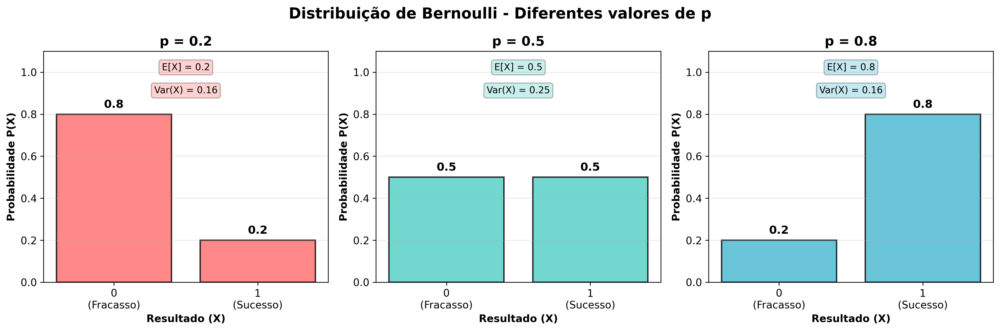
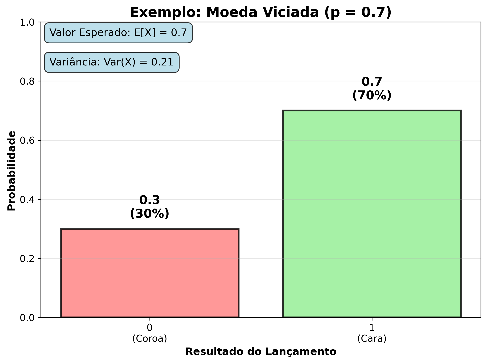

# Variáveis Aleatórias Discretas (VAD)

### O que são?

Uma **variável aleatória discreta** é uma função que atribui um número real a cada resultado possível de um experimento aleatório, com a característica de que essa variável pode assumir apenas **valores distintos e contáveis**. Isso significa que podemos listar todos os valores possíveis que a variável pode tomar, mesmo que essa lista seja infinita (como os números naturais $1, 2, 3, \dots$).

Na prática, a variável aleatória discreta é usada para **quantificar eventos aleatórios**, permitindo a aplicação de ferramentas matemáticas (como a probabilidade, esperança, variância) para estudar os comportamentos esperados e as incertezas de um processo aleatório.

> A palavra "aleatória" indica que o valor assumido pela variável depende de um fenômeno **não determinístico**, ou seja, de um experimento cujos resultados não podem ser previstos com certeza antes da realização.

> A palavra "discreta" significa que a variável **não assume valores contínuos** (como qualquer número real em um intervalo), mas sim **valores pontuais e isolados**.

### Exemplos clássicos do dia a dia:

**Em jogos e sorteios:**
* O número obtido ao lançar um dado ($X \in \{1, 2, 3, 4, 5, 6\}$)
* O resultado de cara ou coroa em uma moeda ($X \in \{0, 1\}$)

**Em contextos familiares e sociais:**
* O número de filhos em uma família ($X \in \{0, 1, 2, 3, ...\}$)
* Número de pessoas que comparecem a um evento ($X \in \{0, 1, 2, ..., n\}$)

**Em tecnologia e comunicação:**
* O número de chamadas recebidas por uma central telefônica em uma hora
* Número de e-mails recebidos por dia
* Quantidade de cliques em um anúncio online

**Em medicina e testes:**
* O resultado de um teste diagnóstico: "positivo" ou "negativo" (representado por 1 ou 0)
* Número de pacientes que respondem positivamente a um tratamento

**Em controle de qualidade:**
* Número de produtos defeituosos em um lote
* Quantidade de erros encontrados em um software

### Representação formal:

Seja $S$ o espaço amostral de um experimento (o conjunto de todos os resultados possíveis). Uma **variável aleatória discreta $X$** é uma função:

$$
X: S \rightarrow \mathbb{R}
$$

tal que o conjunto dos valores possíveis $\{x_1, x_2, \dots\} \subset \mathbb{R}$ é finito ou enumerável.

**Exemplo detalhado:**

Ao jogar dois dados, o espaço amostral tem 36 pares ordenados possíveis: (1,1), (1,2), ..., (6,6). 

Podemos definir diferentes variáveis aleatórias sobre esse espaço:
- **$X_1$**: soma dos valores dos dados (varia de 2 a 12)
- **$X_2$**: produto dos valores (varia de 1 a 36)
- **$X_3$**: maior valor entre os dois dados (varia de 1 a 6)

Cada variável aleatória extrai uma informação específica do experimento, simplificando a análise. Por exemplo, para analisar a soma dos dados, não precisamos considerar todos os 36 resultados individuais, apenas os 11 valores possíveis de soma (2, 3, 4, ..., 12) e suas respectivas probabilidades.

### Por que são importantes?

As variáveis aleatórias discretas são fundamentais em:

* **Modelagem estatística**, onde muitos fenômenos reais envolvem contagens ou decisões binárias.
* **Teoria da probabilidade**, como base para outras distribuições (binomial, geométrica, Poisson).
* **Ciência de dados e IA**, onde eventos discretos como cliques, falhas, aprovações, etc., são representados por variáveis discretas.
* **Engenharia e computação**, como em redes de filas, processos estocásticos, codificação e criptografia.


### Características principais:

Uma **variável aleatória discreta (VAD)** é definida por suas propriedades matemáticas e probabilísticas fundamentais, que a distinguem de outros tipos de variáveis (como as contínuas). As principais características são:

---

#### 🔹 1. Conjunto de valores **finito ou enumerável**

Isso significa que a variável aleatória pode assumir apenas um número **contável** de valores distintos. Os valores podem ser:

* Um conjunto **finito**, como $\{0, 1\}$, $\{1, 2, 3, 4, 5, 6\}$, etc.
* Um conjunto **infinito enumerável**, como os números naturais $\mathbb{N} = \{0, 1, 2, 3, \dots\}$.

Esse conjunto é chamado de **suporte** da variável aleatória, e é onde sua função de probabilidade é diferente de zero.

> 📌 Exemplo:
> Se $X$ é o número de chamadas recebidas em uma central de atendimento por minuto, então $X \in \{0, 1, 2, 3, ...\}$ — conjunto infinito enumerável.

---

#### 🔹 2. Cada valor tem uma **probabilidade associada**

A variável aleatória discreta é definida por sua **função de probabilidade de massa** (f.p.m.), ou em inglês **Probability Mass Function (PMF)**. Essa função é uma associação:

$
f(x) = P(X = x), \quad \text{para cada } x \in \text{suporte de } X
$

Ou seja, para cada valor $x$ que $X$ pode assumir, existe uma probabilidade $P(X = x)$, tal que:

* $0 \leq P(X = x) \leq 1$ (todas as probabilidades são válidas)
* A soma das probabilidades é igual a 1:

$
\sum_{x \in \text{suporte}} P(X = x) = 1
$

> 🎲 Exemplo (lançamento de um dado justo):
> A variável $X \in \{1, 2, 3, 4, 5, 6\}$ tem:
>
> $
> P(X = x) = \frac{1}{6}, \quad \text{para todo } x
> $

---

#### 🔹 3. O comportamento de $X$ pode ser descrito por **propriedades estatísticas**

Uma variável aleatória discreta permite o cálculo de medidas importantes como:

* **Esperança matemática (valor esperado)**:

  $
  \mathbb{E}[X] = \sum_{x} x \cdot P(X = x)
  $

  Interpreta-se como a média ponderada dos valores possíveis, de acordo com suas probabilidades.

* **Variância**:

  $
  \text{Var}(X) = \mathbb{E}[(X - \mathbb{E}[X])^2] = \sum_{x} (x - \mathbb{E}[X])^2 \cdot P(X = x)
  $

  Mede a dispersão dos valores em torno da média.

* **Moda** (valor com maior probabilidade), **mediana**, **função de distribuição acumulada (FDA ou CDF)**, entre outras.

---

#### 🔹 4. São base para modelagem de muitos fenômenos discretos

Variáveis aleatórias discretas são amplamente usadas para modelar:

* **Contagens** (número de eventos, chamadas, falhas, etc.)
* **Experimentos com resultado binário** (sucesso/fracasso)
* **Jogos de azar** (dados, moedas, cartas)
* **Processos estocásticos discretos** (cadeias de Markov)
* **Modelos probabilísticos de algoritmos** (randomização, hashing, simulações de Monte Carlo)

---

## O que é a Função de Probabilidade de Massa (PMF)?

A **função de probabilidade de massa** é a forma como **atribuímos probabilidades a cada valor** possível de uma **variável aleatória discreta**.

Formalmente, para uma variável aleatória discreta $X$, a PMF é uma função $f$ tal que:

$
f(x) = P(X = x), \quad \text{para cada } x \text{ no suporte de } X
$

Essa função precisa satisfazer duas condições fundamentais:

1. **Não-negatividade:**

   $
   P(X = x) \geq 0 \quad \text{para todo } x
   $

2. **Soma das probabilidades igual a 1:**

   $
   \sum_{x \in \text{suporte}} P(X = x) = 1
   $

---

### Exemplo Passo a Passo: Jogar um dado justo de 6 lados

### Etapa 1: Definir o experimento

> Lançamento de um dado comum, com 6 faces numeradas de 1 a 6.

### Etapa 2: Definir a variável aleatória

> Seja $X$ a variável aleatória que representa o **número obtido** ao lançar o dado.

Então:

$
X \in \{1, 2, 3, 4, 5, 6\}
$

### Etapa 3: Atribuir probabilidades

Como o dado é **justo**, todos os valores têm **igual chance** de acontecer. Como há 6 possibilidades:

$
P(X = x) = \frac{1}{6}, \quad \text{para todo } x \in \{1, 2, 3, 4, 5, 6\}
$

---

### Etapa 4: Montar a Tabela da PMF

| $x$ | $P(X = x)$    |
| --- | ------------- |
| 1   | $\frac{1}{6}$ |
| 2   | $\frac{1}{6}$ |
| 3   | $\frac{1}{6}$ |
| 4   | $\frac{1}{6}$ |
| 5   | $\frac{1}{6}$ |
| 6   | $\frac{1}{6}$ |

---

### Etapa 5: Verificar propriedades da PMF

1. **Não-negatividade:**
   Todas as probabilidades são $\frac{1}{6} > 0$ → ok.

2. **Soma das probabilidades:**

   $
   \sum_{x=1}^6 P(X = x) = 6 \cdot \frac{1}{6} = 1
   $

   → ok.

---

### Etapa 6: Usar a PMF para cálculos

####  Cálculo da esperança (valor esperado):

$
\mathbb{E}[X] = \sum_{x=1}^6 x \cdot P(X = x) = \sum_{x=1}^6 x \cdot \frac{1}{6}
= \frac{1}{6}(1 + 2 + 3 + 4 + 5 + 6) = \frac{21}{6} = 3{,}5
$

#### Cálculo da variância:

$
\text{Var}(X) = \sum_{x=1}^6 (x - 3{,}5)^2 \cdot \frac{1}{6}
$

Calculando os termos individualmente:

| $x$ | $(x - 3{,}5)^2$ |
| --- | --------------- |
| 1   | $6{,}25$        |
| 2   | $2{,}25$        |
| 3   | $0{,}25$        |
| 4   | $0{,}25$        |
| 5   | $2{,}25$        |
| 6   | $6{,}25$        |

Somando:

$
\text{Var}(X) = \frac{1}{6} (6{,}25 + 2{,}25 + 0{,}25 + 0{,}25 + 2{,}25 + 6{,}25) = \frac{17{,}5}{6} = 2{,}9167
$

---

A função de probabilidade de massa (PMF) é uma **ferramenta essencial** na estatística e probabilidade, pois permite:

* Mapear os **valores possíveis** de uma variável aleatória para suas **respectivas probabilidades**.
* Fazer **cálculos analíticos** como esperança, variância e distribuição acumulada.
* Aplicar modelos estatísticos para simular ou prever comportamentos.

Esse exemplo do dado é um **caso clássico de PMF equiprovável**, mas podemos fazer o mesmo com distribuições **não uniformes**, como a Bernoulli, binomial, geométrica, etc.

---

## 2. Distribuição Equiprovável (ou uniforme discreta)

### Definição Formal

A **distribuição uniforme discreta**, também conhecida como **distribuição equiprovável discreta**, ocorre quando uma variável aleatória discreta $X$ pode assumir $n$ valores distintos e **todos têm a mesma probabilidade de ocorrência**. Isto é, não há nenhum viés ou preferência entre os valores possíveis: o sistema é **completamente simétrico** do ponto de vista probabilístico.

Seja o espaço amostral finito:

$
S = \{x_1, x_2, \dots, x_n\}
$

Então:

$
P(X = x_i) = \frac{1}{n} \quad \text{para todo } i = 1, 2, ..., n
$

### Interpretação Intuitiva

Imagine uma urna com $n$ bolas numeradas de 1 até $n$, todas do mesmo tamanho e sem marcações externas. Se você sortear uma bola sem olhar, a chance de qualquer número aparecer é exatamente $\frac{1}{n}$. Isso é uma distribuição equiprovável.

É a base conceitual para definir o que chamamos de "experimento justo".

---

### Representação Gráfica

A função de massa de probabilidade (f.p.m.) de uma distribuição uniforme discreta pode ser representada por um gráfico de **barras com a mesma altura**.

Exemplo: $X \sim \text{Uniforme}(1, 5)$

Valores possíveis: $\{1, 2, 3, 4, 5\}$
Probabilidades: $P(X = x) = 0{,}2$ para cada $x$

Gráfico:

```
 P(X=x)
   |
 0.2 | █ █ █ █ █
     +------------
        1 2 3 4 5
```

---

### 📊 Função de Distribuição Acumulada (F.D.A)

A função acumulada $F(x) = P(X \leq x)$ da distribuição uniforme discreta é uma **função em degraus**. Para $X \sim \text{Uniforme}(a, b)$:

$
F(x) = 
\begin{cases}
0 & x < a \\
\frac{\lfloor x \rfloor - a + 1}{b - a + 1} & a \leq x \leq b \\
1 & x > b
\end{cases}
$

---

### 📈 Esperança Matemática

Se $X \in \{x_1, x_2, ..., x_n\}$ com todos os $x_i$ igualmente prováveis, a **esperança matemática** (valor esperado ou média) é dada por:

$
\mathbb{E}[X] = \sum_{i=1}^{n} x_i \cdot \frac{1}{n} = \frac{1}{n} \sum_{i=1}^{n} x_i
$

**Caso clássico:**
Se $X \in \{1, 2, ..., n\}$:

$
\mathbb{E}[X] = \frac{1 + 2 + \cdots + n}{n} = \frac{n+1}{2}
$

---

### 📉 Variância

A variância mede o quanto os valores da variável aleatória se afastam da média.

$
\text{Var}(X) = \mathbb{E}[X^2] - (\mathbb{E}[X])^2
$

Para $X \in \{1, 2, ..., n\}$, a fórmula fechada é:

$
\text{Var}(X) = \frac{(n^2 - 1)}{12}
$

👉 Isso deriva da soma dos quadrados dos $n$ primeiros números naturais:

$
\mathbb{E}[X^2] = \frac{1}{n} \sum_{i=1}^{n} i^2 = \frac{(n+1)(2n+1)}{6n}
$

---

### Entropia

A **entropia** $H(X)$, que mede a incerteza associada à distribuição, é máxima quando os eventos são equiprováveis:

$
H(X) = -\sum_{i=1}^{n} \frac{1}{n} \log_2\left(\frac{1}{n}\right) = \log_2(n)
$

Portanto, quanto maior $n$, maior a incerteza.

---

### Aplicações

#### 🧪 1. Teoria das Probabilidades

* Ponto de partida para definir espaço amostral e eventos equiprováveis.
* Definição de **probabilidade clássica**:

  $
  P(A) = \frac{\text{número de casos favoráveis}}{\text{número total de casos possíveis}}
  $

#### 🕹 2. Jogos e Simulações

* Lançamento de dados (6 valores).
* Roletas, cartas, loterias.
* Geração de números aleatórios simulando cenários onde todos os casos têm a mesma chance.

#### 🤖 3. Computação e Algoritmos

* Algoritmos de embaralhamento (ex: Fisher-Yates).
* Distribuição base para **random walk** e simulações Monte Carlo.
* Balanceamento de carga aleatória.

#### 🧮 4. Inferência e Estatística

* Amostragem aleatória simples: escolher unidades da população com igual probabilidade.
* Testes estatísticos onde a hipótese nula assume distribuição uniforme dos resultados.

---

### 🔁 Extensões

* **Uniforme Contínua:** Quando os valores possíveis formam um intervalo contínuo $[a, b]$, com densidade constante $f(x) = \frac{1}{b - a}$.
* **Multivariada Uniforme Discreta:** Variáveis vetoriais onde todos os vetores de um domínio discreto têm mesma chance de serem observados.

---

A **distribuição uniforme discreta** é um **modelo fundamental e simétrico** na teoria das probabilidades. Ela é simples, mas extremamente útil, aparecendo em contextos didáticos, computacionais e estatísticos. A igualdade de chances entre os valores possíveis a torna um **modelo neutro de referência**, essencial para modelagem inicial de incerteza, simulação e inferência estatística.

1. Definir a variável aleatória com $n$ valores igualmente prováveis.
2. Simular valores com `numpy`.
3. Plotar a distribuição de frequências com `matplotlib`.
4. Calcular a média e a variância empíricas e comparar com os valores teóricos.

---

### Exemplo prático: Lançamento de uma moeda viciada

### Cenário

Imagine uma moeda que não é justa — ela tem 70% de chance de dar **cara** e 30% de chance de dar **coroa**. Queremos modelar essa situação usando uma variável aleatória Bernoulli, onde:

* **Sucesso (X = 1):** sair cara
* **Fracasso (X = 0):** sair coroa

Assim, $p = 0.7$.

---

### Passo 1: Definir a variável aleatória $X$

Definimos $X$ como:

$
X = \begin{cases}
1 & \text{se sair cara} \\
0 & \text{se sair coroa}
\end{cases}
$

---

### Passo 2: Escrever a função de probabilidade

A função de massa de probabilidade é:

$
P(X = x) = p^x (1 - p)^{1 - x}, \quad x \in \{0,1\}
$

Para nosso caso:

* $P(X=1) = 0.7$
* $P(X=0) = 0.3$

---

### Passo 3: Calcular a esperança (valor esperado)

$
\mathbb{E}[X] = 1 \times P(X=1) + 0 \times P(X=0) = 1 \times 0.7 + 0 \times 0.3 = 0.7
$

Interpretação: Em muitos lançamentos, a média de caras será 70%.

---

### Passo 4: Calcular a variância

$
\text{Var}(X) = p(1-p) = 0.7 \times 0.3 = 0.21
$

Isso mede a variabilidade dos resultados.

---

### Passo 5: Interpretar resultados

* A moeda tem alta probabilidade de dar cara (70%).
* Em muitas repetições, a média de caras será próxima a 0.7.
* A variância indica que há alguma dispersão (não é 0, logo nem sempre sai cara).

---

### Passo 6: Simular 10 lançamentos (exemplo)

Suponha que lançamos essa moeda 10 vezes, observando $X_i$ em cada lançamento.

| Lançamento | Resultado (X\_i) |
| ---------- | ---------------- |
| 1          | 1 (cara)         |
| 2          | 0 (coroa)        |
| 3          | 1 (cara)         |
| 4          | 1 (cara)         |
| 5          | 0 (coroa)        |
| 6          | 1 (cara)         |
| 7          | 1 (cara)         |
| 8          | 0 (coroa)        |
| 9          | 1 (cara)         |
| 10         | 1 (cara)         |

Número de caras: 7 (ou seja, 7 sucessos)

Média amostral: $\frac{7}{10} = 0.7$, exatamente o valor esperado!

### 🧪 Exemplo em Python

```python
import numpy as np
import matplotlib.pyplot as plt

# Parâmetros da distribuição
a = 1           # menor valor
b = 6           # maior valor
n = b - a + 1   # número de valores possíveis

# Número de simulações
N = 100_000

# Simulação da variável aleatória uniforme discreta
valores = np.random.randint(a, b + 1, size=N)

# Cálculo das frequências relativas (probabilidades empíricas)
valores_unicos, contagens = np.unique(valores, return_counts=True)
frequencias_relativas = contagens / N

# Cálculo teórico
media_teorica = (a + b) / 2
variancia_teorica = ((b - a + 1)**2 - 1) / 12

# Cálculo empírico
media_empirica = np.mean(valores)
variancia_empirica = np.var(valores)

# Impressão dos resultados
print(f"Valores possíveis: {valores_unicos}")
print(f"Frequências relativas: {frequencias_relativas}")
print(f"Média teórica: {media_teorica:.4f} | Média empírica: {media_empirica:.4f}")
print(f"Variância teórica: {variancia_teorica:.4f} | Variância empírica: {variancia_empirica:.4f}")

# Plotagem do gráfico de barras
plt.figure(figsize=(8, 4))
plt.bar(valores_unicos, frequencias_relativas, color='royalblue', edgecolor='black')
plt.axhline(y=1/n, color='red', linestyle='--', label=f'Prob. teórica = {1/n:.2f}')
plt.title(f'Distribuição Uniforme Discreta (a={a}, b={b})')
plt.xlabel('Valores')
plt.ylabel('Frequência Relativa')
plt.legend()
plt.grid(True, axis='y', linestyle=':', alpha=0.7)
plt.tight_layout()
plt.show()
```

## Exemplo 1: Lançamento de um dado - "obter número 6"

### Cenário

* Experimento: lançar um dado justo de 6 faces.
* Definimos o sucesso como **"sair o número 6"**.
* Resultado possível da variável $X$:

  * $X = 1$ se sair 6 (sucesso).
  * $X = 0$ se sair outro número (fracasso).

### Passo 1: Determinar $p$

Probabilidade de sucesso:

$
p = P(X=1) = P(\text{sair 6}) = \frac{1}{6} \approx 0,1667
$

Logo,

$
P(X=0) = 1 - p = \frac{5}{6} \approx 0,8333
$

### Passo 2: Escrever a função de probabilidade

$
P(X=x) = p^{x} (1-p)^{1-x}, \quad x \in \{0,1\}
$

Ou seja,

* $P(X=1) = 0,1667$
* $P(X=0) = 0,8333$

### Passo 3: Calcular expectativa e variância

* Esperança:

$
\mathbb{E}[X] = p = 0,1667
$

Interpretação: em média, o dado “sai 6” em cerca de 16,67% dos lançamentos.

* Variância:

$
\text{Var}(X) = p(1-p) = 0,1667 \times 0,8333 = 0,1389
$

### Passo 4: Interpretação final

Esse modelo Bernoulli ajuda a responder perguntas do tipo: "Qual a chance de obter um 6 no dado em um lançamento?", "Qual é o comportamento esperado e variabilidade?".

---

## Exemplo 2: Um teste médico para detectar uma doença

### Cenário

* Um teste clínico detecta a doença em pacientes com 90% de eficácia (probabilidade de sucesso).
* Variável $X$:

  * $X = 1$ se o teste detectar corretamente a doença (sucesso).
  * $X = 0$ se o teste falhar (fracasso).

### Passo 1: Determinar $p$

$
p = 0.9
$

Logo,

$
P(X=1) = 0.9, \quad P(X=0) = 0.1
$

### Passo 2: Função de probabilidade

$
P(X=x) = 0.9^{x} \times 0.1^{1-x}, \quad x \in \{0,1\}
$

* $P(X=1) = 0.9$
* $P(X=0) = 0.1$

### Passo 3: Calcular expectativa e variância

* Esperança:

$
\mathbb{E}[X] = p = 0.9
$

* Variância:

$
\text{Var}(X) = p(1-p) = 0.9 \times 0.1 = 0.09
$

### Passo 4: Interpretação

O teste é muito eficiente, com alta chance de sucesso. A variância baixa indica que a chance de falha é pequena.


---

### 📊 Saída Esperada

* Um gráfico de barras onde todas as alturas (frequências relativas) estão próximas de $\frac{1}{n}$, indicando equiprobabilidade.
* Impressão da média e variância teóricas e empíricas, que devem estar muito próximas quando $N$ é grande.

---

### 🧠 Explicação

* `np.random.randint(a, b+1, size=N)` gera amostras da distribuição uniforme discreta no intervalo $[a, b]$.
* `np.unique(..., return_counts=True)` contabiliza a frequência de cada valor.
* As comparações entre **teoria** e **simulação** mostram como a distribuição se comporta na prática.


---

## 🟢 3. Distribuição de Bernoulli

Claro! Vamos aprofundar bastante a seção sobre a **Distribuição de Bernoulli**, detalhando sua origem, propriedades matemáticas, interpretações, generalizações, exemplos práticos, e sua importância no contexto estatístico e computacional.

---

## 🟢 3. Distribuição de Bernoulli (versão aprofundada)

### Introdução e contexto histórico

A distribuição de Bernoulli é uma das distribuições probabilísticas mais simples e fundamentais. Seu nome vem do matemático suíço **Jacob Bernoulli** (1654–1705), que foi um dos pioneiros no estudo da probabilidade e da análise combinatória. A distribuição modela o resultado de um experimento ou ensaio que possui exatamente **dois resultados possíveis mutuamente exclusivos e exaustivos**, comumente chamados de **"sucesso"** e **"fracasso"**.

---

### Definição formal

Seja $X$ uma variável aleatória discreta que representa o resultado de um ensaio com dois possíveis resultados:

* $X = 1$ (sucesso)
* $X = 0$ (fracasso)

A variável $X$ segue uma distribuição de Bernoulli com parâmetro $p$, denotada por $X \sim \text{Bernoulli}(p)$, se

$
P(X = 1) = p, \quad P(X = 0) = 1 - p
$

onde

* $p \in [0,1]$ é a probabilidade de sucesso;
* $1-p$ é a probabilidade de fracasso.

A função de massa de probabilidade (f.p.m.) é dada por:

$
P(X = x) = p^{x} (1-p)^{1-x}, \quad \text{para } x \in \{0,1\}
$

---

### Interpretação intuitiva

Imagine uma moeda que, ao ser lançada, pode dar "cara" ou "coroa". Se a moeda for justa, $p = 0.5$ e ambos os resultados são igualmente prováveis. Porém, se a moeda for viciada, $p \neq 0.5$, e a chance de "cara" é diferente da chance de "coroa". Essa é a essência da distribuição de Bernoulli.

Mas essa distribuição não se limita a moedas. Qualquer situação binária pode ser modelada por ela, como:

* Passar ou não em um teste.
* Acontecimento ou não de um evento (ex: um dispositivo falha ou funciona).
* Compra ou não de um produto pelo consumidor.

---

### Propriedades matemáticas importantes

1. **Esperança (média):**

A esperança de $X$, que indica o valor médio esperado de sucesso, é

$
\mathbb{E}[X] = 1 \cdot p + 0 \cdot (1-p) = p
$

Ou seja, o valor esperado é simplesmente a probabilidade de sucesso.

2. **Variância:**

A variância mede a dispersão dos valores em torno da média. Para Bernoulli:

$
\text{Var}(X) = \mathbb{E}[X^2] - (\mathbb{E}[X])^2
$

Como $X^2 = X$ para $X \in \{0,1\}$,

$
\text{Var}(X) = p - p^2 = p(1-p)
$

Note que a variância é máxima quando $p = 0.5$ e mínima (zero) quando $p = 0$ ou $p = 1$, refletindo a certeza no resultado.

3. **Momento gerador (MGF):**

O momento gerador é uma função útil para calcular momentos e para caracterizar a distribuição:

$
M_X(t) = \mathbb{E}[e^{tX}] = (1-p) + p e^{t}
$

---

### Função de distribuição acumulada (CDF)

A CDF $F(x) = P(X \leq x)$ para $X \sim \text{Bernoulli}(p)$ é:

$
F(x) = \begin{cases}
0, & x < 0 \\
1 - p, & 0 \leq x < 1 \\
1, & x \geq 1
\end{cases}
$

Por ser discreta, a CDF tem saltos em $x=0$ e $x=1$.

---

### Relações e generalizações

* **Distribuição Binomial:** A soma de $n$ variáveis aleatórias independentes e identicamente distribuídas (i.i.d.) Bernoulli($p$) tem distribuição Binomial($n,p$).

$
Y = \sum_{i=1}^n X_i \sim \text{Binomial}(n,p)
$

* **Distribuição Geométrica:** Modela o número de ensaios até o primeiro sucesso em uma sequência de Bernoullis.

* **Distribuição de Poisson:** Pode ser vista como um limite da distribuição binomial para eventos raros.

---

### Exemplo detalhado

Suponha que um teste médico tenha 80% de chance de detectar corretamente uma doença (sucesso). Seja $X$ a variável que indica se o teste foi positivo (1) ou negativo (0).

* $P(X=1) = 0.8$
* $P(X=0) = 0.2$

A esperança é $\mathbb{E}[X] = 0.8$, indicando que, em média, o teste detecta a doença 80% das vezes. A variância é $0.8 \times 0.2 = 0.16$, mostrando a dispersão do resultado em torno da média.

---

### Aplicações práticas em ciência e tecnologia

* **Machine Learning e Estatística:**
  Classificadores binários, testes de hipóteses, modelos probabilísticos e redes neurais usam a Bernoulli para modelar saídas binárias (verdadeiro/falso).

* **Engenharia de Confiabilidade:**
  Modelagem de falhas de componentes (funciona/falha).

* **Marketing e Economia:**
  Análise de compra vs. não compra, sucesso vs. fracasso em campanhas.

* **Ciência da Computação:**
  Simulações de eventos aleatórios, algoritmos probabilísticos.

---

### Exemplo

```python


import numpy as np

# Parâmetro da Bernoulli
p = 0.7

# Número de lançamentos
n = 10

# Simulação dos lançamentos (0 ou 1)
resultados = np.random.binomial(n=1, p=p, size=n)

# Mostrar resultados
print("Resultados dos lançamentos:", resultados)
print("Número de caras (sucessos):", np.sum(resultados))
print("Média amostral:", np.mean(resultados))

```

### 📊 Visualizações Gráficas

#### Comparação de Diferentes Valores de p



Este gráfico mostra como a distribuição de Bernoulli se comporta com diferentes valores de p:
- **p = 0.2**: Baixa probabilidade de sucesso (20%)
- **p = 0.5**: Probabilidades iguais para sucesso e fracasso (moeda justa)
- **p = 0.8**: Alta probabilidade de sucesso (80%)

#### Exemplo Prático: Moeda Viciada



Visualização do exemplo da moeda viciada com p = 0.7, mostrando que:
- A chance de cara (sucesso) é 70%
- A chance de coroa (fracasso) é 30%
- O valor esperado é 0.7
- A variância é 0.21

> **💡 Para gerar essas visualizações**, execute o script:
> ```bash
> python3 generate_bernoulli_visualization.py
> ```

### Curiosidades e observações

* Embora simples, a Bernoulli é a base para modelos probabilísticos mais complexos.
* O parâmetro $p$ pode ser interpretado como a "taxa de sucesso".
* Em inferência estatística, estimar $p$ a partir de dados Bernoulli é um problema clássico (ex: proporção amostral).

A **distribuição de Bernoulli** é o alicerce para entender processos aleatórios binários. Sua simplicidade esconde uma riqueza matemática e uma ampla aplicabilidade prática que permeia quase todas as áreas da ciência e da engenharia.

Se quiser, posso mostrar códigos para simulação, exemplos de estimativa de $p$ em amostras, ou explicações de como a Bernoulli conecta com outras distribuições. Quer que eu faça?


### Aplicações:

* Modelagem de ensaios binários (sucesso/fracasso).
* Fundamento da distribuição **binomial** (soma de Bernoullis).
* Em IA, aprendizado supervisionado binário.
* Testes A/B em marketing, produção ou ciência de dados.

---

## 🔁 Comparando Equiprovável e Bernoulli

| Característica             | Distribuição Equiprovável | Distribuição de Bernoulli |
| -------------------------- | ------------------------- | ------------------------- |
| Valores possíveis          | $x_1, x_2, ..., x_n$      | 0 ou 1                    |
| Probabilidades             | Iguais                    | $p$ e $1-p$               |
| Tamanho do espaço amostral | $n$                       | 2                         |
| Esperança                  | $\frac{1}{n} \sum x_i$    | $p$                       |
| Variância                  | Depende de $x_i$          | $p(1 - p)$                |
| Uso comum                  | Jogos, sorteios           | Sucesso/fracasso binário  |

---

---

## 📝 Exercícios Resolvidos

### Exercício 1: Teste de Qualidade Industrial

**Enunciado:** Uma fábrica de componentes eletrônicos tem uma taxa de defeitos de 5% em sua produção. Seja $X$ a variável aleatória que indica se um componente é defeituoso (1) ou não (0). 

a) Modele essa situação usando uma distribuição de Bernoulli.
b) Calcule a esperança e a variância de $X$.
c) Se inspecionarmos 10 componentes, qual a probabilidade de encontrarmos exatamente 2 defeituosos?

**Solução:**

**Parte a) Modelagem:**
Definimos a variável aleatória $X$ como:
$$X = \begin{cases}
1 & \text{se o componente é defeituoso (sucesso)} \\
0 & \text{se o componente não é defeituoso (fracasso)}
\end{cases}$$

Como a taxa de defeitos é 5%, temos $p = 0{,}05$.

Logo, $X \sim \text{Bernoulli}(0{,}05)$ com função de probabilidade:
$$P(X = x) = 0{,}05^x \times 0{,}95^{1-x}, \quad x \in \{0,1\}$$

Especificamente:
- $P(X = 1) = 0{,}05$ (probabilidade de defeito)
- $P(X = 0) = 0{,}95$ (probabilidade de não haver defeito)

**Parte b) Esperança e Variância:**

Esperança:
$$\mathbb{E}[X] = p = 0{,}05$$

**Interpretação:** Em média, 5% dos componentes são defeituosos.

Variância:
$$\text{Var}(X) = p(1-p) = 0{,}05 \times 0{,}95 = 0{,}0475$$

**Parte c) Probabilidade com 10 componentes:**
Para 10 componentes independentes, definimos $Y = \sum_{i=1}^{10} X_i$ onde cada $X_i \sim \text{Bernoulli}(0{,}05)$.

Então $Y \sim \text{Binomial}(10, 0{,}05)$.

A probabilidade de exatamente 2 defeituosos é:
$$P(Y = 2) = \binom{10}{2} \times 0{,}05^2 \times 0{,}95^8$$

$$P(Y = 2) = 45 \times 0{,}0025 \times 0{,}6634 = 0{,}0746$$

**Resposta:** Aproximadamente 7,46% de chance de encontrar exatamente 2 componentes defeituosos.

---

### Exercício 2: Eficácia de Tratamento Médico

**Enunciado:** Um novo medicamento tem 80% de eficácia no tratamento de uma doença. Seja $X$ a variável que indica se o tratamento foi eficaz (1) ou não (0) para um paciente.

a) Determine a distribuição de $X$ e sua função de probabilidade.
b) Calcule $P(X = 1)$, $\mathbb{E}[X]$ e $\text{Var}(X)$.
c) Interprete os resultados no contexto médico.

**Solução:**

**Parte a) Distribuição:**
$X \sim \text{Bernoulli}(0{,}8)$

Função de probabilidade:
$$P(X = x) = 0{,}8^x \times 0{,}2^{1-x}, \quad x \in \{0,1\}$$

**Parte b) Cálculos:**
- $P(X = 1) = 0{,}8$ (80% de eficácia)
- $P(X = 0) = 0{,}2$ (20% de falha)

Esperança:
$$\mathbb{E}[X] = 0{,}8$$

Variância:
$$\text{Var}(X) = 0{,}8 \times 0{,}2 = 0{,}16$$

**Parte c) Interpretação médica:**
- O medicamento tem alta probabilidade de sucesso (80%)
- A esperança de 0,8 indica que, em média, o tratamento é eficaz em 8 de cada 10 pacientes
- A variância de 0,16 mostra que há alguma incerteza no resultado, mas é relativamente baixa devido à alta eficácia

---

### Exercício 3: Marketing Digital - Taxa de Conversão

**Enunciado:** Uma campanha de marketing digital tem taxa de conversão de 12%. Seja $X$ a variável que indica se um visitante do site faz uma compra (1) ou não (0).

a) Modele usando Bernoulli e calcule as probabilidades.
b) Determine esperança, variância e desvio padrão.
c) Em uma amostra de 100 visitantes, quantas conversões esperamos?

**Solução:**

**Parte a) Modelagem:**
$X \sim \text{Bernoulli}(0{,}12)$

- $P(X = 1) = 0{,}12$ (conversão)
- $P(X = 0) = 0{,}88$ (sem conversão)

**Parte b) Medidas estatísticas:**

Esperança:
$$\mathbb{E}[X] = 0{,}12$$

Variância:
$$\text{Var}(X) = 0{,}12 \times 0{,}88 = 0{,}1056$$

Desvio padrão:
$$\sigma = \sqrt{0{,}1056} = 0{,}325$$

**Parte c) Expectativa para 100 visitantes:**
Para $n = 100$ visitantes independentes, o número esperado de conversões é:
$$\mathbb{E}[\text{Total de conversões}] = n \times p = 100 \times 0{,}12 = 12 \text{ conversões}$$

---

### Exercício 4: Controle de Qualidade em Software

**Enunciado:** Um sistema de detecção de bugs identifica corretamente 95% dos erros em códigos de software. Modelamos cada teste como uma variável de Bernoulli $X$.

a) Defina $X$ e determine sua distribuição.
b) Se o sistema analisar 5 códigos independentes, qual a probabilidade de detectar bugs em todos?
c) E a probabilidade de falhar na detecção em pelo menos um código?

**Solução:**

**Parte a) Definição:**
$$X = \begin{cases}
1 & \text{se o bug é detectado corretamente} \\
0 & \text{se o bug não é detectado (falha)}
\end{cases}$$

$X \sim \text{Bernoulli}(0{,}95)$

**Parte b) Probabilidade de sucesso em todos os 5 códigos:**
Para códigos independentes, a probabilidade de sucesso em todos é:
$$P(\text{sucesso em todos}) = P(X_1 = 1, X_2 = 1, ..., X_5 = 1)$$
$$= P(X_1 = 1) \times P(X_2 = 1) \times ... \times P(X_5 = 1)$$
$$= 0{,}95^5 = 0{,}7738$$

**Parte c) Probabilidade de pelo menos uma falha:**
$$P(\text{pelo menos uma falha}) = 1 - P(\text{nenhuma falha})$$
$$= 1 - 0{,}95^5 = 1 - 0{,}7738 = 0{,}2262$$

**Interpretação:** Há cerca de 22,62% de chance de o sistema falhar na detecção em pelo menos um dos 5 códigos analisados.

---

## 🎯 Exercícios Propostos

### Exercício 1 (Nível Básico)
Uma moeda honesta é lançada uma vez. Seja $X$ a variável aleatória que vale 1 se sair cara e 0 se sair coroa.
a) Determine a distribuição de $X$.
b) Calcule $\mathbb{E}[X]$ e $\text{Var}(X)$.
c) Encontre $P(X = 0)$ e $P(X = 1)$.

### Exercício 2 (Nível Básico)
Em um teste de múltipla escolha com 4 alternativas, um aluno chuta uma questão aleatoriamente. Seja $Y$ a variável que indica acerto (1) ou erro (0).
a) Modele $Y$ como uma Bernoulli.
b) Qual a probabilidade de acerto?
c) Calcule esperança e variância de $Y$.

### Exercício 3 (Nível Intermediário)
Uma empresa de delivery tem 8% de pedidos com atraso. Modelamos cada entrega como uma Bernoulli, onde 1 indica atraso.
a) Defina a variável aleatória e sua distribuição.
b) Se a empresa processar 20 pedidos independentes, qual a probabilidade de todos chegarem no prazo?
c) Qual o número esperado de atrasos em 50 entregas?

### Exercício 4 (Nível Intermediário)
Um sensor de segurança tem probabilidade de falha de 0,02 em cada operação. Seja $X$ a variável que indica falha (1) ou funcionamento normal (0).
a) Determine $\mathbb{E}[X]$ e $\text{Var}(X)$.
b) Em 10 operações independentes, qual a probabilidade de nenhuma falha?
c) Qual a probabilidade de pelo menos uma falha em 10 operações?

### Exercício 5 (Nível Avançado)
Uma rede neural classifica imagens com 92% de acurácia. Considere $X$ como variável Bernoulli onde 1 indica classificação correta.
a) Se processarmos um batch de 100 imagens, quantas classificações corretas esperamos?
b) Calcule a probabilidade de acertar exatamente 90 classificações.
c) Determine o intervalo que contém 95% das classificações corretas esperadas (use aproximação normal se necessário).

### Exercício 6 (Nível Avançado)
Em um estudo clínico, a taxa de cura de um tratamento experimental é de 75%. Cada paciente pode ser modelado como uma Bernoulli independente.
a) Para uma amostra de 30 pacientes, calcule a esperança e variância do número de curas.
b) Use a aproximação normal para estimar a probabilidade de que entre 20 e 25 pacientes sejam curados.
c) Quantos pacientes devem ser incluídos no estudo para que a probabilidade de pelo menos 80% de curas seja superior a 90%?
## 💼 Exemplos Práticos em Contextos Reais

### Como estudante de estatística...
**Quero ver exemplos práticos de variáveis de Bernoulli**  
**Para que eu possa entender melhor aplicações reais desse conceito.**

A seguir, apresentamos exemplos contextualizados que demonstram como as variáveis de Bernoulli aparecem em situações do mundo real, cada um acompanhado de código Python para simulação e análise.

---

### 🏥 Exemplo 1: Teste Médico para COVID-19

**Contexto:** Um laboratório desenvolveu um teste rápido para COVID-19 que tem 85% de acurácia na detecção da doença.

**Variável de Bernoulli:** 
- $X = 1$: Teste detecta corretamente a presença do vírus (sucesso)
- $X = 0$: Teste falha na detecção (fracasso)
- $p = 0.85$ (probabilidade de sucesso)

```python
import numpy as np
import matplotlib.pyplot as plt
from scipy.stats import bernoulli

# Parâmetros do teste médico
p_deteccao = 0.85
nome_teste = "Teste COVID-19"

# Simulação de 1000 testes
n_testes = 1000
resultados_teste = bernoulli.rvs(p_deteccao, size=n_testes)

# Análise dos resultados
sucessos = np.sum(resultados_teste)
taxa_sucesso_observada = sucessos / n_testes

print(f"=== {nome_teste} ===")
print(f"Probabilidade teórica de detecção: {p_deteccao:.1%}")
print(f"Número de testes realizados: {n_testes}")
print(f"Detecções corretas observadas: {sucessos}")
print(f"Taxa de sucesso observada: {taxa_sucesso_observada:.1%}")
print(f"Diferença da teoria: {abs(taxa_sucesso_observada - p_deteccao):.1%}")

# Propriedades estatísticas
media_teorica = p_deteccao
variancia_teorica = p_deteccao * (1 - p_deteccao)
desvio_padrao_teorico = np.sqrt(variancia_teorica)

print(f"\nPropriedades estatísticas:")
print(f"Média (valor esperado): {media_teorica:.3f}")
print(f"Variância: {variancia_teorica:.3f}")
print(f"Desvio-padrão: {desvio_padrao_teorico:.3f}")
```

**Interpretação:** Em média, o teste detecta corretamente 85% dos casos. A variância de 0.128 indica moderada dispersão nos resultados.

---

### 📱 Exemplo 2: Taxa de Clique em Anúncios Online

**Contexto:** Uma empresa de marketing digital quer analisar a eficácia de um anúncio que tem taxa de clique de 3.5%.

**Variável de Bernoulli:**
- $X = 1$: Usuário clica no anúncio (sucesso)
- $X = 0$: Usuário não clica (fracasso)  
- $p = 0.035$ (taxa de clique)

```python
# Parâmetros da campanha publicitária
p_clique = 0.035
nome_campanha = "Campanha Produto X"

# Simulação de 10.000 visualizações
n_visualizacoes = 10000
resultados_clique = bernoulli.rvs(p_clique, size=n_visualizacoes)

# Análise dos resultados
total_cliques = np.sum(resultados_clique)
ctr_observado = total_cliques / n_visualizacoes  # Click-Through Rate

print(f"=== {nome_campanha} ===")
print(f"Taxa de clique esperada: {p_clique:.1%}")
print(f"Visualizações do anúncio: {n_visualizacoes:,}")
print(f"Cliques obtidos: {total_cliques}")
print(f"CTR observado: {ctr_observado:.2%}")

# Análise de intervalo de confiança (aproximação)
erro_padrao = np.sqrt(p_clique * (1 - p_clique) / n_visualizacoes)
intervalo_confianca = 1.96 * erro_padrao  # 95% de confiança

print(f"\nAnálise estatística:")
print(f"Erro padrão estimado: {erro_padrao:.4f}")
print(f"Intervalo de confiança 95%: [{p_clique - intervalo_confianca:.3%}, {p_clique + intervalo_confianca:.3%}]")

# Verificação se resultado está no intervalo esperado
if abs(ctr_observado - p_clique) <= intervalo_confianca:
    print("✅ Resultado dentro do esperado!")
else:
    print("⚠️ Resultado fora do intervalo esperado - investigar!")
```

**Interpretação:** Taxas de clique baixas são comuns em publicidade digital. A variável de Bernoulli ajuda a modelar e prever o comportamento dos usuários.

---

### 🏭 Exemplo 3: Controle de Qualidade Industrial

**Contexto:** Uma fábrica de semicondutores tem 2% de taxa de defeito em seus chips. O controle de qualidade precisa monitorar esta taxa.

**Variável de Bernoulli:**
- $X = 1$: Chip defeituoso (sucesso para o evento que queremos monitorar)
- $X = 0$: Chip em perfeito estado (fracasso)

> **Nota:** Em estatística, chamamos de "sucesso" o evento que estamos contando/interessados, mesmo que ele seja indesejado na prática (como encontrar um defeito). O termo não implica que seja algo positivo, apenas que é o evento de interesse para a análise.
- $p = 0.02$ (taxa de defeito)

```python
# Parâmetros do controle de qualidade
p_defeito = 0.02
nome_processo = "Produção de Chips"

# Simulação de um lote de produção
tamanho_lote = 5000
resultados_inspecao = bernoulli.rvs(p_defeito, size=tamanho_lote)

# Análise dos resultados
chips_defeituosos = np.sum(resultados_inspecao)
taxa_defeito_observada = chips_defeituosos / tamanho_lote

print(f"=== {nome_processo} ===")
print(f"Taxa de defeito esperada: {p_defeito:.1%}")
print(f"Tamanho do lote inspecionado: {tamanho_lote:,}")
print(f"Chips defeituosos encontrados: {chips_defeituosos}")
print(f"Taxa de defeito observada: {taxa_defeito_observada:.2%}")

# Análise para tomada de decisão
limite_superior_aceitavel = 0.025  # 2.5%
if taxa_defeito_observada <= limite_superior_aceitavel:
    decisao = "✅ LOTE APROVADO"
    print(f"{decisao} - Qualidade dentro do padrão")
else:
    decisao = "❌ LOTE REJEITADO"
    print(f"{decisao} - Taxa de defeito acima do aceitável")

# Estimativa de perdas financeiras
custo_por_chip = 50.00  # R$ 50 por chip
perda_financeira = chips_defeituosos * custo_por_chip
print(f"\nImpacto financeiro:")
print(f"Custo estimado com defeitos: R$ {perda_financeira:,.2f}")
print(f"Perda percentual do lote: {taxa_defeito_observada:.2%}")
```

**Interpretação:** O controle de qualidade usa a distribuição de Bernoulli para tomar decisões sobre aprovação ou rejeição de lotes de produção.

---

### 🎓 Exemplo 4: Taxa de Aprovação em Vestibular

**Contexto:** Um cursinho pré-vestibular tem histórico de 40% de aprovação de seus alunos em universidades públicas.

**Variável de Bernoulli:**
- $X = 1$: Aluno aprovado no vestibular (sucesso)
- $X = 0$: Aluno não aprovado (fracasso)
- $p = 0.40$ (taxa de aprovação)

```python
# Parâmetros do vestibular
p_aprovacao = 0.40
nome_instituicao = "Cursinho Sucesso"

# Simulação de uma turma
n_alunos = 150
resultados_vestibular = bernoulli.rvs(p_aprovacao, size=n_alunos)

# Análise dos resultados
aprovados = np.sum(resultados_vestibular)
taxa_aprovacao_observada = aprovados / n_alunos

print(f"=== {nome_instituicao} ===")
print(f"Taxa histórica de aprovação: {p_aprovacao:.1%}")
print(f"Número de alunos na turma: {n_alunos}")
print(f"Alunos aprovados: {aprovados}")
print(f"Taxa de aprovação da turma: {taxa_aprovacao_observada:.1%}")

# Comparação com a meta
meta_aprovacao = 0.45  # Meta de 45%
diferenca_meta = taxa_aprovacao_observada - meta_aprovacao

print(f"\nAnálise de desempenho:")
print(f"Meta estabelecida: {meta_aprovacao:.1%}")
if diferenca_meta >= 0:
    print(f"✅ Meta ATINGIDA! Superou em {diferenca_meta:.1%}")
else:
    print(f"❌ Meta NÃO atingida. Faltaram {abs(diferenca_meta):.1%}")

# Simulação de cenários futuros
print(f"\nProjeções para próximas turmas:")
for tamanho in [100, 200, 300]:
    aprovados_esperados = int(tamanho * p_aprovacao)
    print(f"Turma de {tamanho} alunos: ~{aprovados_esperados} aprovações esperadas")
```

**Interpretação:** Instituições de ensino usam dados históricos modelados como Bernoulli para estabelecer metas e projetar resultados futuros.

---

### 📊 Exemplo Avançado: Comparação Visual de Cenários

```python
import matplotlib.pyplot as plt

# Definindo diferentes cenários
cenarios = {
    "Teste COVID-19": 0.85,
    "Clique em Anúncio": 0.035,
    "Defeito Industrial": 0.02,
    "Aprovação Vestibular": 0.40
}

# Criando visualização comparativa
fig, ((ax1, ax2), (ax3, ax4)) = plt.subplots(2, 2, figsize=(15, 10))
axes = [ax1, ax2, ax3, ax4]

for idx, (cenario, p) in enumerate(cenarios.items()):
    # Simulação
    n_simulacoes = 1000
    resultados = bernoulli.rvs(p, size=n_simulacoes)
    
    # Média móvel para mostrar convergência
    media_movel = np.cumsum(resultados) / np.arange(1, n_simulacoes + 1)
    
    ax = axes[idx]
    ax.plot(media_movel, color='blue', alpha=0.7)
    ax.axhline(y=p, color='red', linestyle='--', label=f'p = {p:.3f}')
    ax.set_title(f'{cenario}')
    ax.set_xlabel('Número de Ensaios')
    ax.set_ylabel('Média Acumulada')
    ax.legend()
    ax.grid(True, alpha=0.3)

plt.suptitle('Convergência da Média Amostral para p (Lei dos Grandes Números)', fontsize=16)
plt.tight_layout()
plt.show()

# Resumo comparativo
print("=== RESUMO COMPARATIVO ===")
print(f"{'Cenário':<20} {'p':<8} {'E[X]':<8} {'Var(X)':<8} {'σ':<8}")
print("-" * 60)
for cenario, p in cenarios.items():
    media = p
    variancia = p * (1 - p)
    desvio = np.sqrt(variancia)
    print(f"{cenario:<20} {p:<8.3f} {media:<8.3f} {variancia:<8.3f} {desvio:<8.3f}")
```

**Interpretação Final:** A visualização mostra como a Lei dos Grandes Números funciona na prática - conforme aumentamos o número de experimentos, a média amostral converge para o valor teórico de $p$.

---

## 📘 Conclusão

As distribuições **equiprovável** e **de Bernoulli** são fundamentais para compreender experimentos aleatórios discretos. Enquanto a equiprovável lida com simetria (todos os resultados com mesma chance), a Bernoulli introduz **assimetria binária**, sendo essencial para aplicações probabilísticas em estatística, aprendizado de máquina e ciências aplicadas.

---

## **Referências e Links para Aprofundamento**

### **📚 Livros Fundamentais**

- BUSSAB, W. O.; MORETTIN, P. A. *Estatística Básica*. 9. ed. São Paulo: Saraiva, 2017.
- ROSS, S. M. *A First Course in Probability*. 10. ed. Pearson, 2019.
- MOOD, A. M.; GRAYBILL, F. A.; BOES, D. C. *Introduction to the Theory of Statistics*. 3. ed. McGraw-Hill, 1974.
- TRIOLA, M. F. *Introdução à Estatística*. 12. ed. Rio de Janeiro: LTC, 2017.
- MEYER, P. L. *Probabilidade: Aplicações à Estatística*. 2. ed. Rio de Janeiro: LTC, 2009.

### **🎓 Textos Avançados**

- CASELLA, G.; BERGER, R. L. *Statistical Inference*. 2. ed. Duxbury Press, 2001.
- DEGROOT, M. H.; SCHERVISH, M. J. *Probability and Statistics*. 4. ed. Boston: Addison-Wesley, 2012.
- HOGG, R. V.; CRAIG, A. T. *Introduction to Mathematical Statistics*. 8. ed. Pearson, 2018.
- LARSEN, R. J.; MARX, M. L. *An Introduction to Mathematical Statistics and Its Applications*. 6. ed. Pearson, 2017.

### **🌐 Recursos Online de Qualidade**

#### **Cursos e Vídeos**
- **Khan Academy - Probabilidade**: https://pt.khanacademy.org/math/statistics-probability
- **MIT OpenCourseWare - Probability**: https://ocw.mit.edu/courses/mathematics/18-05-introduction-to-probability-and-statistics-spring-2014/
- **Coursera - Probability Theory**: https://www.coursera.org/learn/probability-theory-foundation-for-data-science
- **edX - Probability and Statistics**: https://www.edx.org/course/introduction-probability-science

#### **Documentação Técnica**
- **SciPy Stats Module**: https://docs.scipy.org/doc/scipy/reference/stats.html
- **NumPy Random**: https://numpy.org/doc/stable/reference/random/index.html
- **Matplotlib Gallery**: https://matplotlib.org/stable/gallery/statistics/index.html

#### **Simuladores Interativos**
- **Seeing Theory**: https://seeing-theory.brown.edu/basic-probability/
- **PhET Simulations**: https://phet.colorado.edu/sims/html/plinko-probability/latest/plinko-probability_pt_BR.html
- **GeoGebra - Probability**: https://www.geogebra.org/probability

### **📱 Ferramentas e Software**

#### **Python**
- **SciPy**: https://scipy.org/ - Biblioteca científica para Python
- **StatsModels**: https://www.statsmodels.org/ - Modelagem estatística
- **Seaborn**: https://seaborn.pydata.org/ - Visualização estatística

#### **R**
- **R Project**: https://www.r-project.org/
- **RStudio**: https://www.rstudio.com/
- **CRAN Task View - Distributions**: https://cran.r-project.org/web/views/Distributions.html

#### **Outras Ferramentas**
- **Wolfram Alpha**: https://www.wolframalpha.com/
- **Desmos Calculator**: https://www.desmos.com/calculator
- **StatCrunch**: https://www.statcrunch.com/

### **🎯 Aplicações Específicas**

#### **Machine Learning e Data Science**
- HASTIE, T.; TIBSHIRANI, R.; FRIEDMAN, J. *The Elements of Statistical Learning*. 2. ed. Springer, 2009.
- BISHOP, C. M. *Pattern Recognition and Machine Learning*. Springer, 2006.

#### **Economia e Finanças**
- HULL, J. C. *Options, Futures, and Other Derivatives*. 10. ed. Pearson, 2017.

#### **Engenharia de Confiabilidade**
- LAWLESS, J. F. *Statistical Models and Methods for Lifetime Data*. 2. ed. John Wiley & Sons, 2003.

### **📖 Artigos Históricos e Fundadores**

- BERNOULLI, J. *Ars Conjectandi*. Basel: Thurnisiorum, 1713. (Obra fundadora da teoria da probabilidade)
- CARDANO, G. *Liber de Ludo Aleae*. 1564. (Um dos primeiros tratados sobre probabilidade)
- PASCAL, B.; FERMAT, P. Correspondência sobre jogos de azar, 1654.

### **💡 Recursos para Diferentes Níveis**

#### **Iniciante**
- MAGALHÃES, M. N.; LIMA, A. C. P. *Noções de Probabilidade e Estatística*. 7. ed. São Paulo: EDUSP, 2010.
- BARBETTA, P. A.; REIS, M. M.; BORNIA, A. C. *Estatística para Cursos de Engenharia e Informática*. 3. ed. São Paulo: Atlas, 2010.

#### **Intermediário**
- MONTGOMERY, D. C.; RUNGER, G. C. *Applied Statistics and Probability for Engineers*. 7. ed. John Wiley & Sons, 2018.
- WALPOLE, R. E. et al. *Probabilidade e Estatística para Engenharia e Ciências*. 8. ed. São Paulo: Pearson, 2009.

#### **Avançado**
- FELLER, W. *An Introduction to Probability Theory and Its Applications*. 2 volumes. John Wiley & Sons, 1968-1971.
- BILLINGSLEY, P. *Probability and Measure*. 3. ed. John Wiley & Sons, 1995.

---

**💡 Dica de Estudo:** Comece entendendo bem o conceito da distribuição de Bernoulli com exemplos simples (moeda, teste aprovado/reprovado) antes de avançar para suas aplicações em modelos mais complexos como regressão logística e redes neurais.
