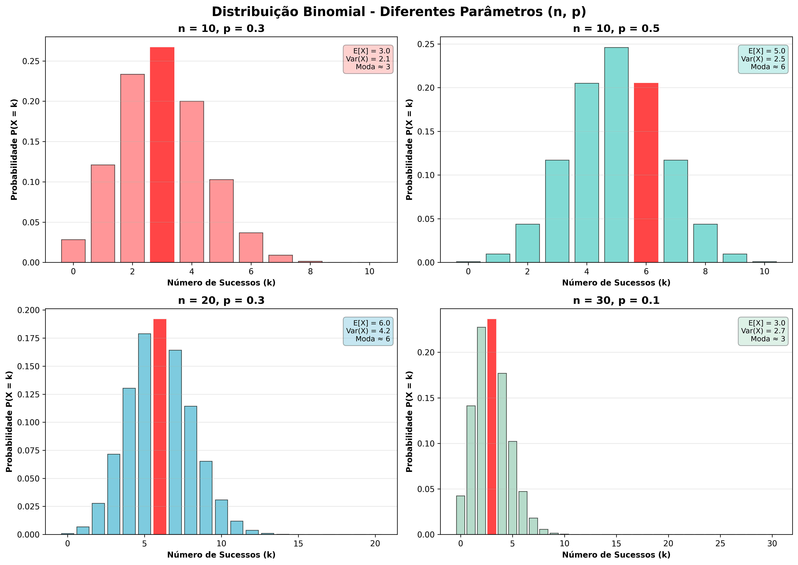
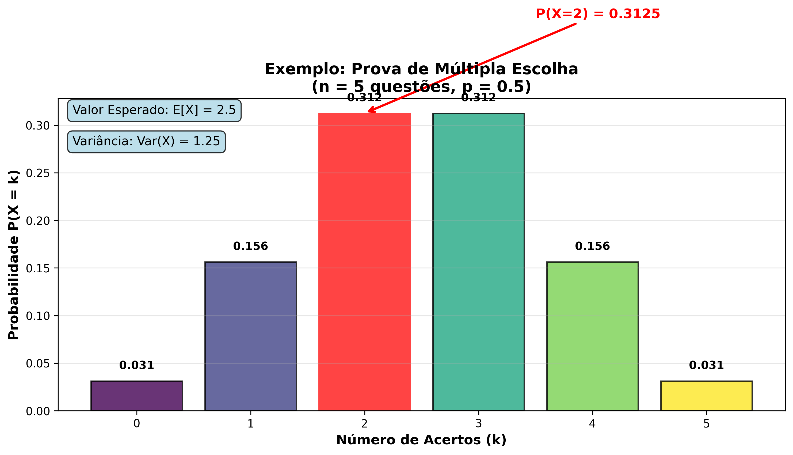
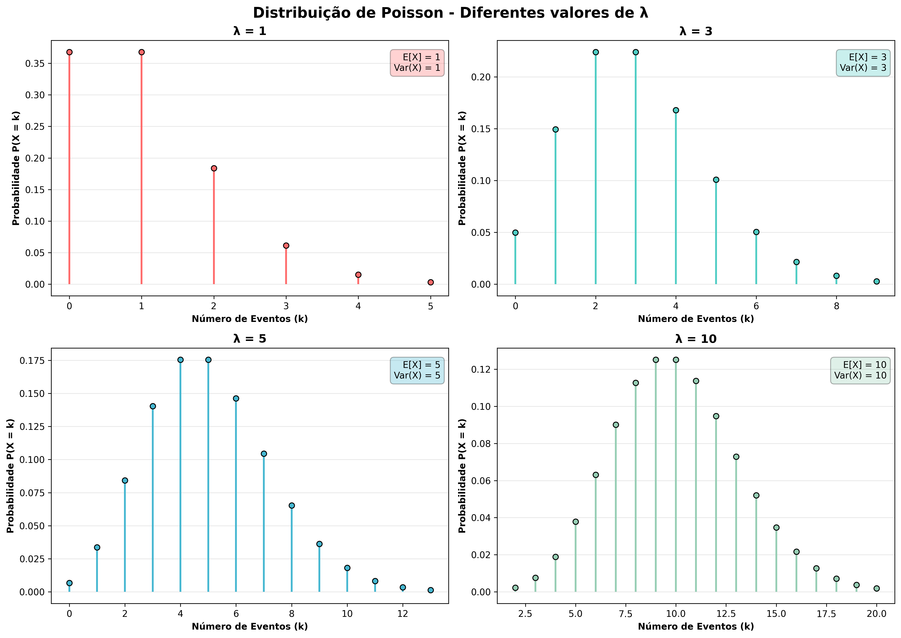
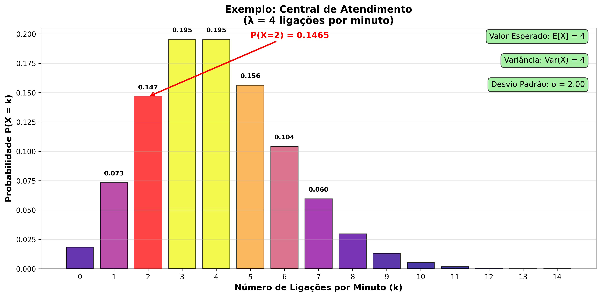

# Distribuição Binomial

A distribuição binomial é um modelo matemático usado para descrever situações onde realizamos um experimento várias vezes — digamos, **n** vezes — e em cada vez, o resultado pode ser só um de dois possíveis: **sucesso** ou **fracasso**. Por exemplo:

* Lançar uma moeda várias vezes e contar quantas vezes sai “cara” (considerando “cara” como sucesso).
* Testar se um componente eletrônico funciona ou não em vários testes, contando quantos testes foram “sucesso” (funcionou).
* Em uma pesquisa, perguntar a várias pessoas se aprovam ou não um certo produto, contando quantos aprovaram.

O objetivo da distribuição binomial é calcular a **probabilidade** de obter exatamente **k** sucessos em **n** tentativas.

---

### Por que a distribuição é discreta?

Porque o número de sucessos $k$ só pode ser um número inteiro entre 0 e $n$ (não faz sentido ter 2,5 sucessos, por exemplo). Ou seja, os possíveis valores de $k$ são discretos, o que justifica chamar essa distribuição de **discreta**.

---

### Tentativas independentes e com probabilidade constante

Para a distribuição binomial funcionar, duas condições importantes precisam ser verdadeiras:

* **Independência**: o resultado de cada tentativa não pode influenciar o resultado das outras. Por exemplo, se você lança uma moeda, o resultado da jogada 1 não muda a probabilidade da jogada 2.
* **Probabilidade constante**: a chance de sucesso em cada tentativa é sempre a mesma $p$. Não pode variar de tentativa para tentativa.

---

### Comparação com a distribuição de Bernoulli

A distribuição de Bernoulli é um caso especial da distribuição binomial.

* A **Bernoulli** modela uma única tentativa com dois resultados possíveis (sucesso ou fracasso).
* A **binomial** modela a soma dos sucessos em **n** tentativas independentes, cada uma com distribuição Bernoulli.

Em outras palavras:

* Uma variável aleatória Bernoulli $X$ tem valor 1 (sucesso) com probabilidade $p$ e 0 (fracasso) com probabilidade $1-p$.
* Uma variável aleatória Binomial $Y$ é a soma de $n$ variáveis Bernoulli independentes. Ou seja, $Y = X_1 + X_2 + ... + X_n$, onde cada $X_i$ é Bernoulli($p$).

---

### Visualização intuitiva

* Bernoulli: um único tiro, você acerta (1) ou erra (0).
* Binomial: você dá $n$ tiros e quer saber quantos acertos (1's) teve no total.

---

### Por que isso importa?

Muitos fenômenos do dia a dia, testes científicos e processos industriais podem ser modelados usando a distribuição binomial, pois muitos eventos ocorrem em sequência e são independentes, com resultados binários.

Por exemplo:

* Qual a chance de uma fábrica produzir exatamente 3 produtos defeituosos em uma caixa com 20 itens, sabendo que a probabilidade de defeito é 5%?
* Quantos emails spam vou receber em 10 emails, sabendo que 40% dos emails são spam?


Beleza! Vou explicar a fórmula da distribuição binomial, detalhando cada parte, como lê-la e o que significa cada elemento.

---

## Fórmula da distribuição binomial

A probabilidade de obter exatamente **k** sucessos em **n** tentativas independentes, com probabilidade de sucesso $p$ em cada tentativa, é dada por:

$$
P(X = k) = \binom{n}{k} \, p^k \, (1 - p)^{n - k}
$$

---

### Como ler essa fórmula

“**A probabilidade de que a variável aleatória $X$ seja igual a $k$ (ou seja, de obter exatamente $k$ sucessos), é igual ao número de combinações possíveis de $k$ sucessos em $n$ tentativas, multiplicado pela probabilidade de sucesso elevada a $k$, vezes a probabilidade de fracasso elevada a $n-k$.**”

---

### Explicação de cada termo

1. **$P(X = k)$**

   * Representa a probabilidade de ocorrer exatamente $k$ sucessos.
   * Exemplo: a chance de dar exatamente 4 caras em 10 lançamentos de moeda.

2. **$\binom{n}{k}$ (coeficiente binomial)**

   * Também lido como "n escolhe k".
   * Representa o **número de formas diferentes** de escolher quais $k$ tentativas, dentre as $n$ totais, serão os sucessos.
   * Fórmula:

     $$
     \binom{n}{k} = \frac{n!}{k! (n-k)!}
     $$

     onde $n!$ (fatorial) é o produto de todos os inteiros positivos até $n$.
   * Exemplo: em 10 jogadas, quantas maneiras diferentes posso ter exatamente 4 caras? São essas maneiras que o coeficiente binomial conta.

3. **$p^k$**

   * É a probabilidade de sucesso, elevada à potência do número de sucessos.
   * Como cada sucesso tem probabilidade $p$, a chance de $k$ sucessos ocorrerem juntos (em uma sequência fixa) é $p \times p \times ... \times p = p^k$.

4. **$(1-p)^{n-k}$**

   * É a probabilidade de fracasso, elevada ao número de fracassos (que é $n - k$).
   * Como a probabilidade de fracasso em uma tentativa é $1-p$, e ocorrem $n-k$ fracassos, a chance deles ocorrerem juntos é $(1-p)^{n-k}$.

---

### Por que multiplicar tudo?

* Primeiro, você escolhe **quais** tentativas são os sucessos — e o número dessas combinações é $\binom{n}{k}$.
* Depois, para **cada uma dessas combinações específicas**, a chance de ocorrer exatamente essa sequência (com $k$ sucessos e $n-k$ fracassos) é a multiplicação das probabilidades individuais, $p^k \times (1-p)^{n-k}$.
* Como essas combinações são mutuamente exclusivas (não se sobrepõem), somamos a probabilidade para todas elas multiplicando o número de combinações pelo valor da probabilidade de cada uma.

---

### Um exemplo rápido para fixar

Se você quer calcular a probabilidade de obter exatamente 3 caras em 5 lançamentos de moeda:

* $n = 5$
* $k = 3$
* $p = 0.5$ (moeda justa)

Então:

$$
P(X=3) = \binom{5}{3} (0.5)^3 (1-0.5)^{5-3} = 10 \times 0.125 \times 0.25 = 0.3125
$$

Ou seja, cerca de 31,25% de chance.

---

Perfeito! Vamos fazer **dois exemplos práticos** com a **fórmula da distribuição binomial**, mostrando passo a passo.

---

### ✅ **Exemplo 1: Probabilidade de passar em uma prova de múltipla escolha**

Um aluno tem 5 questões de múltipla escolha com duas alternativas cada (V ou F), e **chuta todas as respostas**. Qual a probabilidade de ele acertar exatamente 2 questões?

#### Informações:

* $n = 5$ (5 questões)
* $k = 2$ (quer acertar exatamente 2)
* $p = 0.5$ (probabilidade de acerto por chute)
* $1 - p = 0.5$ (probabilidade de errar)

#### Aplicando a fórmula:

$$
P(X = 2) = \binom{5}{2} \cdot (0.5)^2 \cdot (0.5)^{5-2}
$$

$$
\binom{5}{2} = \frac{5!}{2! \cdot 3!} = \frac{120}{2 \cdot 6} = 10
$$

$$
P(X = 2) = 10 \cdot (0.25) \cdot (0.125) = 10 \cdot 0.03125 = 0.3125
$$

🔹 **Resultado: 31,25%** de chance de acertar exatamente 2 questões chutando.

---

### ✅ **Exemplo 2: Defeitos em peças de uma fábrica**

Uma máquina tem uma taxa de defeito de 10%. Se ela produz 8 peças, qual a probabilidade de exatamente 1 peça sair com defeito?

#### Informações:

* $n = 8$ (peças)
* $k = 1$ (exatamente 1 defeituosa)
* $p = 0.1$ (chance de defeito = sucesso)
* $1 - p = 0.9$ (chance de peça boa = fracasso)

#### Aplicando a fórmula:

$$
P(X = 1) = \binom{8}{1} \cdot (0.1)^1 \cdot (0.9)^{8 - 1}
$$

$$
\binom{8}{1} = 8
$$

$$
P(X = 1) = 8 \cdot 0.1 \cdot (0.9)^7
$$

$$
(0.9)^7 ≈ 0.4783
$$

$$
P(X = 1) ≈ 8 \cdot 0.1 \cdot 0.4783 = 0.3826
$$

**Resultado: aproximadamente 38,26%** de chance de ter exatamente 1 peça defeituosa entre as 8.


## Exemplo em python

```python
import matplotlib.pyplot as plt
from scipy.stats import binom
import numpy as np

# Exemplo 1: Prova de múltipla escolha (n = 5, p = 0.5, k = 0 a 5)
n1 = 5
p1 = 0.5
x1 = np.arange(0, n1 + 1)
pmf1 = binom.pmf(x1, n1, p1)

# Exemplo 2: Defeitos em peças (n = 8, p = 0.1, k = 0 a 8)
n2 = 8
p2 = 0.1
x2 = np.arange(0, n2 + 1)
pmf2 = binom.pmf(x2, n2, p2)

# Plotando ambos os gráficos lado a lado
fig, axs = plt.subplots(1, 2, figsize=(12, 5))

# Gráfico do Exemplo 1
axs[0].bar(x1, pmf1, color='skyblue')
axs[0].set_title('Exemplo 1: Prova de Múltipla Escolha\nn=5, p=0.5')
axs[0].set_xlabel('Número de acertos (k)')
axs[0].set_ylabel('Probabilidade')
axs[0].axhline(y=pmf1[2], color='red', linestyle='--', label=f'P(X=2)={pmf1[2]:.4f}')
axs[0].legend()

# Gráfico do Exemplo 2
axs[1].bar(x2, pmf2, color='lightgreen')
axs[1].set_title('Exemplo 2: Defeitos em Peças\nn=8, p=0.1')
axs[1].set_xlabel('Número de peças defeituosas (k)')
axs[1].set_ylabel('Probabilidade')
axs[1].axhline(y=pmf2[1], color='red', linestyle='--', label=f'P(X=1)={pmf2[1]:.4f}')
axs[1].legend()

plt.tight_layout()
plt.show()

```

## **Propriedades da Distribuição Binomial**

### **Valor Esperado (Média)**
O valor esperado de uma variável aleatória binomial X ~ Binomial(n, p) é:

$$
E[X] = np
$$

**Interpretação**: Em média, esperamos **np** sucessos em **n** tentativas.

### **Variância**
A variância de uma distribuição binomial é:

$$
Var(X) = np(1-p)
$$

### **Desvio Padrão**
O desvio padrão é:

$$
\sigma = \sqrt{np(1-p)}
$$

### **Exemplo Prático das Propriedades**

Para o exemplo da prova de múltipla escolha (n=5, p=0.5):
- **Média**: E[X] = 5 × 0.5 = 2.5 acertos esperados
- **Variância**: Var(X) = 5 × 0.5 × 0.5 = 1.25
- **Desvio Padrão**: σ = √1.25 ≈ 1.12

### 📊 Visualizações Gráficas - Distribuição Binomial

#### Comparação de Diferentes Parâmetros



Este gráfico mostra como a distribuição binomial varia com diferentes parâmetros:
- **n = 10, p = 0.3**: Poucos sucessos esperados (média = 3)
- **n = 10, p = 0.5**: Distribuição simétrica (média = 5)
- **n = 20, p = 0.3**: Mais tentativas, mesma probabilidade (média = 6)
- **n = 30, p = 0.1**: Muitas tentativas, baixa probabilidade (média = 3)

#### Exemplo: Prova de Múltipla Escolha



Visualização específica do exemplo da prova com 5 questões (n=5, p=0.5):
- Destaque para P(X=2) = 0.3125, conforme calculado no exemplo
- Mostra a simetria da distribuição quando p = 0.5
- Valor esperado de 2.5 acertos

> **💡 Para gerar essas visualizações**, execute o script:
> ```bash
> python3 generate_binomial_poisson_visualization.py
> ```

---

# Distribuição Poisson


## O que é a Distribuição de Poisson?

A **Distribuição de Poisson** é uma distribuição de probabilidade discreta que descreve o número de **eventos que ocorrem em um intervalo fixo de tempo ou espaço**, **quando esses eventos acontecem de forma independente** e com uma **taxa média constante**.

Ela é ideal para modelar **eventos raros** ou **eventos que ocorrem de forma esparsa**.

---

### 🔢 Quando usar a Distribuição de Poisson?

Use Poisson quando:

* Os eventos são **independentes** entre si
* A média de ocorrências por intervalo é **constante**
* O número de eventos possíveis é **teoricamente infinito**, mas ocorrem poucos

---

## 📐 Parâmetro principal: **λ (lambda)**

* Representa a **taxa média de ocorrência** de eventos por intervalo
* Exemplo: λ = 3 → em média, 3 eventos por hora

---

### 📌 Fórmula da distribuição de Poisson (sem aprofundar em matemática):

A fórmula fornece a probabilidade de observar **k eventos** em um intervalo, dada uma média λ.

---

## 🎯 Exemplos do mundo real

1. **Chamadas em um call center**: Suponha que em média 5 ligações cheguem por minuto. A Poisson pode te dizer qual a chance de receber exatamente 3 ligações em um certo minuto.

2. **Defeitos em um rolo de tecido**: Se em média ocorrem 2 defeitos por metro, você pode calcular a chance de ocorrerem exatamente 4 defeitos em 1 metro.

3. **Acidentes de trânsito por dia em uma cidade**: Se ocorrem 10 por dia, qual a chance de ocorrerem 7 em um determinado dia?

---

## 📊 Propriedades importantes

* A média e a variância da distribuição são **iguais**:
  $\mu = \lambda$ e $\sigma^2 = \lambda$

* Quanto maior λ, mais a distribuição se parece com uma curva normal (gaussiana)

---

## 🧮 Passo a passo para aplicar a Poisson

### Exemplo prático:

> Em uma farmácia, chegam em média 4 clientes por hora. Qual a chance de chegarem **exatamente 2 clientes** em uma hora?

#### Etapas:

1. Identifique:

   * λ = 4 (média por hora)
   * k = 2 (número desejado de ocorrências)

2. Use a fórmula da distribuição de Poisson, ou use Python (com `scipy.stats.poisson.pmf(k, λ)`)

3. Interprete o resultado: A probabilidade será em torno de **0,1465** ou 14,65%

---

## 🧠 Resumo:

| Conceito             | Valor                       |
| -------------------- | --------------------------- |
| Tipo de distribuição | Discreta                    |
| Parâmetro principal  | λ (média de eventos)        |
| Eventos              | Independentes               |
| Exemplos             | Chamadas, defeitos, pedidos |
| Média e variância    | Iguais (λ)                  |


### Contexto do Exemplo:

**Problema:**

> Uma central de atendimento recebe em média **4 ligações por minuto**.
> Qual a probabilidade de receber **exatamente 2 ligações** em um minuto?

---

### 🎯 1. Identificar os dados do problema

* Média de eventos por intervalo (λ): **4**
* Número de eventos desejado (k): **2**
* Fórmula da distribuição de Poisson:

$$
P(k; \lambda) = \frac{e^{-\lambda} \cdot \lambda^k}{k!}
$$

---

### 🧮 2. Substituir os valores na fórmula:

$$
P(2; 4) = \frac{e^{-4} \cdot 4^2}{2!}
$$

---

### 📐 3. Calcular os componentes:

* $e^{-4} \approx 0.0183$
* $4^2 = 16$
* $2! = 2$

---

### 🧾 4. Calcular a probabilidade:

$$
P(2; 4) = \frac{0.0183 \cdot 16}{2} = \frac{0.2928}{2} = 0.1464
$$

---

### ✅ 5. Conclusão:

> A probabilidade de receber exatamente **2 ligações** em um minuto é **aproximadamente 14,64%**.

---

Se quiser, posso gerar também uma **visualização em gráfico** desse exemplo, destacando o valor de $k = 2$. Deseja isso?


### Exemplo em python

```python
import numpy as np
import matplotlib.pyplot as plt
from scipy.stats import poisson, binom, norm

# Parâmetros das distribuições
lambda_poisson = 4  # média para Poisson
n_binomial = 20     # número de tentativas na Binomial
p_binomial = 0.2    # probabilidade de sucesso na Binomial
mu_normal = 4       # média para Normal
sigma_normal = 2    # desvio padrão da Normal

# Eixos para valores discretos e contínuos
x_discrete = np.arange(0, 15)
x_continuous = np.linspace(0, 15, 500)

# Funções de probabilidade/densidade
poisson_pmf = poisson.pmf(x_discrete, lambda_poisson)
binomial_pmf = binom.pmf(x_discrete, n_binomial, p_binomial)
normal_pdf = norm.pdf(x_continuous, mu_normal, sigma_normal)

# Plotagem
plt.figure(figsize=(15, 5))

# Gráfico de Poisson
plt.subplot(1, 3, 1)
plt.stem(x_discrete, poisson_pmf, basefmt=" ", use_line_collection=True)
plt.title("Distribuição de Poisson (λ = 4)")
plt.xlabel("k (nº de eventos)")
plt.ylabel("P(k)")
plt.grid(True)

# Gráfico de Binomial
plt.subplot(1, 3, 2)
plt.stem(x_discrete, binomial_pmf, basefmt=" ", linefmt='orange', markerfmt='ro', use_line_collection=True)
plt.title("Distribuição Binomial (n=20, p=0.2)")
plt.xlabel("k (sucessos)")
plt.ylabel("P(k)")
plt.grid(True)

# Gráfico de Normal
plt.subplot(1, 3, 3)
plt.plot(x_continuous, normal_pdf, color='green')
plt.title("Distribuição Normal (μ = 4, σ = 2)")
plt.xlabel("x")
plt.ylabel("f(x)")
plt.grid(True)

# Exibe todos os gráficos
plt.tight_layout()
plt.show()
```

### ✅ O que você precisa para rodar:

* Python 3.x
* Bibliotecas: `matplotlib`, `numpy`, `scipy`

```bash
pip install matplotlib numpy scipy
```

### 📊 Visualizações Gráficas - Distribuição de Poisson

#### Comparação de Diferentes Valores de λ



Este gráfico mostra como a distribuição de Poisson varia com diferentes valores de λ:
- **λ = 1**: Poucos eventos por intervalo, alta concentração no 0 e 1
- **λ = 3**: Distribuição moderada, moda em 3
- **λ = 5**: Distribuição mais espalhada, aproximando-se da normal
- **λ = 10**: Aproximação à distribuição normal, mais simétrica

#### Exemplo: Central de Atendimento



Visualização específica do exemplo da central de atendimento (λ = 4):
- Destaque para P(X=2) ≈ 0.1465, conforme calculado no exemplo
- Mostra que o valor mais provável é próximo a λ = 4
- Demonstra como a distribuição se concentra em torno da média

**Características observadas nos gráficos:**
- Para Poisson: E[X] = Var(X) = λ
- À medida que λ aumenta, a distribuição se torna mais simétrica
- Useful para modelar eventos raros com taxa constante

> **💡 Para gerar essas visualizações**, execute o script:
> ```bash
> python3 generate_binomial_poisson_visualization.py
> ```
