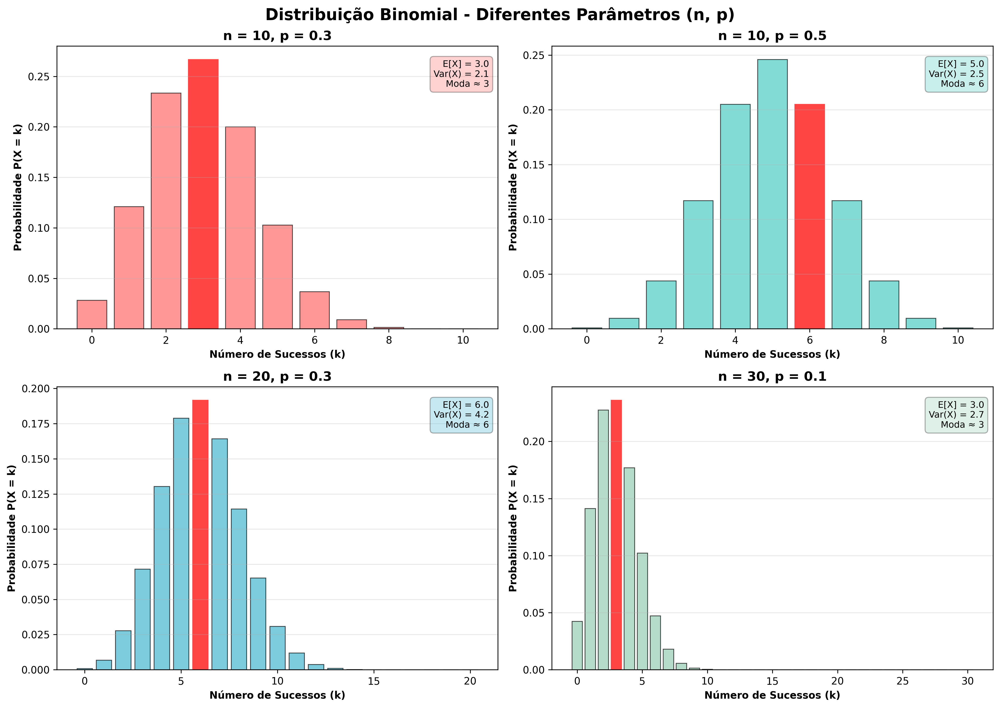
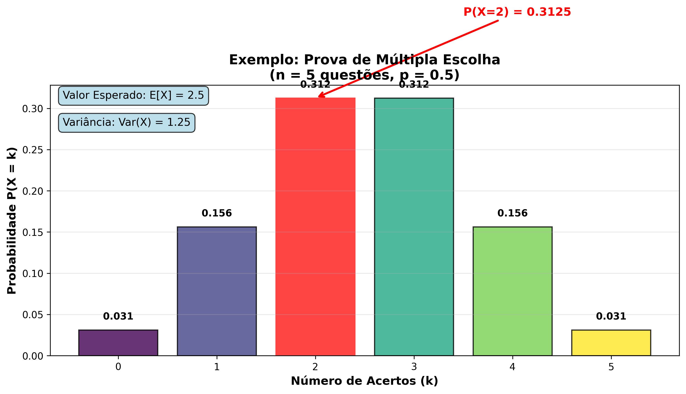
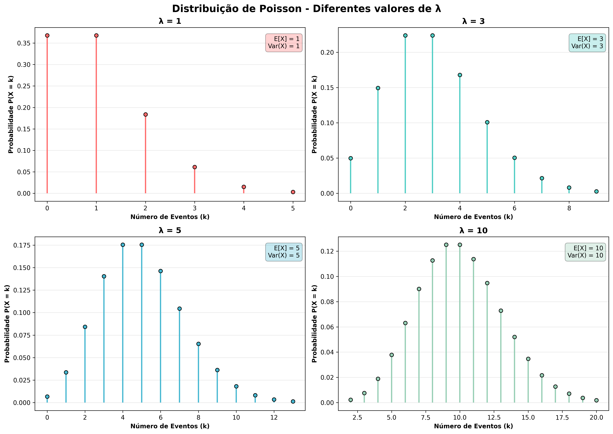
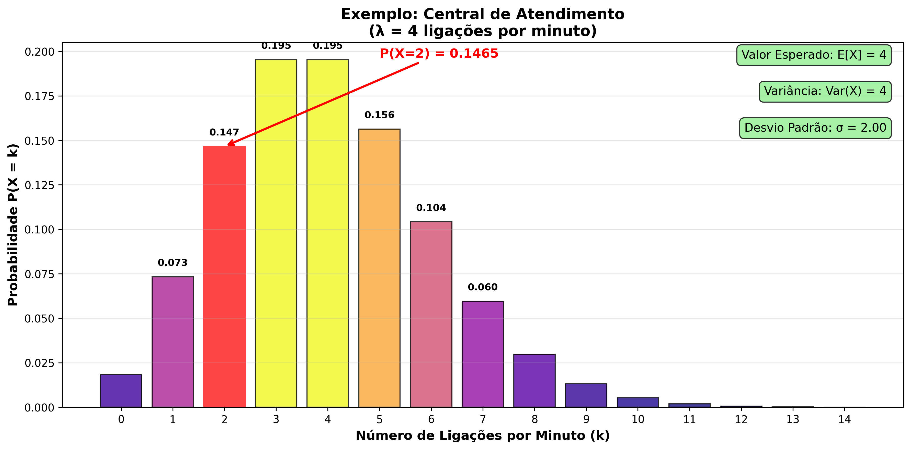

# **Distribuições Binomial e Poisson: Guia Completo**

## **História do Usuário (BDD)**

**Como estudante de estatística**  
**Quero ter um guia completo e detalhado sobre distribuições Binomial e Poisson**  
**Para que eu compreenda profundamente os conceitos, saiba quando aplicá-los e consiga resolver problemas práticos do cotidiano**

---

## Sumário

1. [Distribuição Binomial](#distribuição-binomial)
2. [Distribuição de Poisson](#distribuição-de-poisson)  
3. [Comparação entre as Distribuições](#comparação-entre-as-distribuições)
4. [Aplicações Práticas](#aplicações-práticas)
5. [Exemplos com Python](#exemplos-com-python)

---

# **Distribuição Binomial**

## **O que é?**

A distribuição binomial modela situações onde realizamos **n experimentos independentes**, cada um com apenas **dois resultados possíveis** (sucesso ou fracasso) e **probabilidade constante** de sucesso.

### **Condições Necessárias**
- **Independência**: o resultado de cada tentativa não influencia as outras
- **Probabilidade constante**: a chance de sucesso é sempre a mesma (p)
- **Número fixo de tentativas**: sempre n experimentos

### **Exemplos do Dia a Dia**
- 🪙 Lançar uma moeda 10 vezes e contar quantas "caras" saem
- 🔧 Testar 20 componentes eletrônicos e contar quantos funcionam
- 📊 Perguntar a 100 pessoas se aprovam um produto

### **Fórmula Básica**

$$P(X = k) = \binom{n}{k} \cdot p^k \cdot (1-p)^{n-k}$$

**Onde:**
- **$n$** = número total de tentativas (experimentos realizados)
- **$k$** = número de sucessos desejados (o que queremos calcular)
- **$p$** = probabilidade de sucesso em cada tentativa (valor entre 0 e 1)
- **$(1-p)$** = probabilidade de fracasso em cada tentativa (também chamada de $q$)
- **$\binom{n}{k}$** = coeficiente binomial = $\frac{n!}{k!(n-k)!}$ = número de formas de escolher k sucessos em n tentativas

**Decomposição da fórmula:**

1. **$\binom{n}{k}$**: Conta de quantas maneiras diferentes podemos ter exatamente k sucessos em n tentativas
2. **$p^k$**: Probabilidade de obter exatamente k sucessos (não necessariamente consecutivos)
3. **$(1-p)^{n-k}$**: Probabilidade de obter exatamente (n-k) fracassos
4. O produto desses três termos nos dá a probabilidade total

**Nota importante:** Os sucessos e fracassos podem ocorrer em qualquer ordem. O coeficiente binomial $\binom{n}{k}$ já conta todas as possíveis ordens em que os k sucessos podem aparecer nas n tentativas.

### **Propriedades Importantes**
- **Média**: μ = n × p
- **Variância**: σ² = n × p × (1-p)
- **Desvio Padrão**: σ = √[n × p × (1-p)]

### **Exemplo Simples Passo a Passo**

**Problema**: Em uma prova de 5 questões de múltipla escolha (4 alternativas cada), qual a probabilidade de acertar exatamente 2 questões "no chute"?

**Identificando os parâmetros:**
- **n = 5** (total de 5 questões)
- **k = 2** (queremos exatamente 2 acertos)  
- **p = 0.25** (chance de acertar cada questão = 1/4 = 25%)
- **1-p = 0.75** (chance de errar = 3/4 = 75%)

**Calculando cada parte da fórmula:**

**Passo 1:** Calcular o coeficiente binomial
$$\binom{5}{2} = \frac{5!}{2!(5-2)!} = \frac{5!}{2! \cdot 3!} = \frac{120}{2 \cdot 6} = \frac{120}{12} = 10$$

Isso significa: existem 10 formas diferentes de acertar exatamente 2 questões dentre 5.

**Passo 2:** Calcular a probabilidade dos 2 acertos
$$p^2 = (0.25)^2 = 0.0625$$

**Passo 3:** Calcular a probabilidade dos 3 erros
$$(1-p)^{5-2} = (0.75)^3 = 0.421875$$

**Passo 4:** Multiplicar tudo
$$P(X = 2) = 10 \times 0.0625 \times 0.421875 = 0.2637$$

**Resposta e Interpretação**: 
- Há **26.37%** de chance de acertar exatamente 2 questões
- Em outras palavras: se 1000 alunos fizessem essa prova chutando, esperaríamos que cerca de 264 acertassem exatamente 2 questões
- **Conclusão prática**: Chutar não é uma boa estratégia! A chance de acertar a maioria (3 ou mais) é muito menor.

---

# **Distribuição de Poisson**

## **O que é?**

A distribuição de Poisson modela o **número de eventos que ocorrem em um intervalo fixo** (tempo ou espaço), quando esses eventos são **raros** e **independentes**, com uma **taxa média constante**.

### **Quando Usar?**
- Os eventos são **independentes** entre si
- A **taxa média** de ocorrências é **constante**  
- Os eventos são **raros** em relação ao período observado
- O período/espaço observado é **fixo**

### **Exemplos do Dia a Dia**
- 📧 Número de emails recebidos por hora
- 🚗 Acidentes de trânsito por dia em uma cidade
- 📞 Chamadas telefônicas por minuto em um call center
- ⭐ Estrelas cadentes vistas por noite

### **Fórmula Básica**

$$P(X = k) = \frac{\lambda^k \cdot e^{-\lambda}}{k!}$$

**Onde:**
- **$k$** = número de eventos que queremos calcular a probabilidade (0, 1, 2, 3, ...)
- **$\lambda$ (lambda)** = taxa média de eventos por período (parâmetro da distribuição)
- **$e$** = número de Euler (constante matemática ≈ 2.71828...)
- **$k!$** = fatorial de k (k × (k-1) × (k-2) × ... × 2 × 1)

**Interpretação dos componentes:**

1. **$\lambda$**: É a taxa média esperada. Por exemplo, se em média ocorrem 4 chamadas por minuto, então $\lambda = 4$
2. **$e^{-\lambda}$**: Fator de normalização que garante que a soma de todas as probabilidades seja 1
3. **$\lambda^k$**: Representa a "intensidade" de ocorrer k eventos
4. **$k!$**: Ajusta pela forma como os eventos podem ser contados

**Por que e (número de Euler)?**

A distribuição de Poisson surge naturalmente de processos limitantes da binomial quando n → ∞ e p → 0, mantendo n×p = λ constante. Nesses limites, o número e aparece naturalmente, assim como em muitos processos de crescimento e decaimento na natureza.

**Explicação mais simples:**
Imagine que você está dividindo um intervalo de tempo em pedaços cada vez menores. Por exemplo, dividir 1 minuto em 60 segundos, depois em 6000 centésimos de segundo, e assim por diante. Quando fazemos isso infinitamente, a matemática que descreve "quantas vezes algo acontece" naturalmente envolve o número e. É o mesmo motivo pelo qual e aparece em juros compostos: quanto mais você divide o tempo, mais natural fica usar e = 2.71828...

### **Propriedades Importantes**
- **Média**: μ = λ
- **Variância**: σ² = λ  
- **Desvio Padrão**: σ = √λ

### **Exemplo Simples Passo a Passo**

**Problema**: Um call center recebe em média 4 chamadas por minuto. Qual a probabilidade de receber exatamente 6 chamadas em 1 minuto?

**Identificando os parâmetros:**
- **$\lambda = 4$** (média de 4 chamadas por minuto)
- **$k = 6$** (queremos calcular a probabilidade de exatamente 6 chamadas)

**Calculando cada parte da fórmula:**

**Passo 1:** Calcular $\lambda^k$
$$\lambda^k = 4^6 = 4096$$

**Passo 2:** Calcular $e^{-\lambda}$
$$e^{-\lambda} = e^{-4} \approx 0.0183156$$

(Pode usar calculadora científica ou tabela de valores de $e^x$)

**Passo 3:** Calcular $k!$
$$k! = 6! = 6 \times 5 \times 4 \times 3 \times 2 \times 1 = 720$$

**Passo 4:** Aplicar a fórmula
$$P(X = 6) = \frac{4^6 \cdot e^{-4}}{6!} = \frac{4096 \times 0.0183156}{720} = \frac{75.01}{720} \approx 0.1042$$

**Resposta e Interpretação**: 
- Há **10.42%** de chance de receber exatamente 6 chamadas
- Em 100 minutos observados, esperaríamos ver exatamente 6 chamadas em cerca de 10 desses minutos
- **Contexto prático**: O call center pode usar isso para dimensionar equipe. Se é comum ter 6+ chamadas, precisa de mais atendentes

**Calculando probabilidades acumuladas:**

Frequentemente queremos saber "6 ou menos chamadas" ou "mais de 6 chamadas":

- **P(X ≤ 6)** = P(X=0) + P(X=1) + ... + P(X=6) ≈ 0.8893 (88.93%)
- **P(X > 6)** = 1 - P(X ≤ 6) ≈ 0.1107 (11.07%)

**Conclusão prática**: Em cerca de 89% do tempo, o call center recebe 6 ou menos chamadas por minuto.

---

# **Comparação entre as Distribuições**

| Aspecto | Binomial | Poisson |
|---------|----------|---------|
| **Tipo de experimento** | n tentativas fixas | Eventos em intervalo contínuo |
| **Resultado** | Sucesso/Fracasso | Contagem de eventos raros |
| **Parâmetros** | n (tentativas) e p (probabilidade) | λ (taxa média) |
| **Média** | n × p | λ |
| **Variância** | n × p × (1-p) | λ |
| **Quando usar** | Experimentos com resultado binário | Contagem de eventos raros |

### **Relação Especial: Aproximação de Binomial por Poisson**

Quando **n ≥ 20**, **p ≤ 0,05** e **n×p ≤ 10** (ou seja, n é grande e p é pequeno), a **Binomial pode ser bem aproximada pela Poisson** (com λ = n×p)!

**Por que isso funciona?**
- Com muitas tentativas (n grande) e probabilidade baixa (p pequeno), estamos contando eventos raros
- A Poisson é justamente o modelo ideal para eventos raros
- Matematicamente: lim(n→∞, p→0, np=λ) Binomial(n,p) = Poisson(λ)

**Exemplo prático:**
- Binomial: n=100, p=0.02 → λ = 100×0.02 = 2
- Para P(X=3): Binomial dá 0.1823, Poisson dá 0.1804 (erro < 2%)
- A Poisson é muito mais simples de calcular!

**Quando NÃO aproximar:**
- Se p > 0.10 (eventos não são raros)
- Se n < 20 (poucos experimentos)
- Se n×p > 10 (muitos sucessos esperados)

---

# **Aplicações Práticas**

## **Distribuição Binomial**
- 📊 **Controle de Qualidade**: Testar lotes de produtos e contar defeitos
- 📈 **Marketing**: Análise de conversão em campanhas (clica/não clica)
- 🏥 **Medicina**: Eficácia de tratamentos (melhora/não melhora)
- 🎯 **A/B Testing**: Comparar versões de sites ou aplicativos

## **Distribuição de Poisson**  
- 🚨 **Segurança**: Modelar acidentes, falhas de sistema, ataques cibernéticos
- 📞 **Telecomunicações**: Dimensionar centrais telefônicas e call centers
- 🛒 **Varejo**: Prever demanda e otimizar estoques
- 🚑 **Saúde Pública**: Monitorar surtos de doenças raras

---

# **Exemplos com Python**

```python
import numpy as np
import matplotlib.pyplot as plt
from scipy.stats import binom, poisson

# Configuração dos gráficos
fig, (ax1, ax2) = plt.subplots(1, 2, figsize=(12, 5))

# DISTRIBUIÇÃO BINOMIAL
# Exemplo: 10 lançamentos de moeda (p = 0.5)
n, p = 10, 0.5
x_binom = np.arange(0, n+1)
pmf_binom = binom.pmf(x_binom, n, p)

ax1.bar(x_binom, pmf_binom, alpha=0.7, color='blue')
ax1.set_title('Distribuição Binomial\n(n=10, p=0.5)')
ax1.set_xlabel('Número de sucessos (k)')
ax1.set_ylabel('Probabilidade')
ax1.grid(True, alpha=0.3)

# DISTRIBUIÇÃO POISSON
# Exemplo: 4 eventos por período em média
lam = 4
x_poisson = np.arange(0, 15)
pmf_poisson = poisson.pmf(x_poisson, lam)

ax2.bar(x_poisson, pmf_poisson, alpha=0.7, color='red')
ax2.set_title('Distribuição Poisson\n(λ=4)')
ax2.set_xlabel('Número de eventos (k)')
ax2.set_ylabel('Probabilidade')
ax2.grid(True, alpha=0.3)

plt.tight_layout()
plt.show()

# Calculando probabilidades específicas
print("=== BINOMIAL ===")
print(f"P(X = 5) = {binom.pmf(5, n, p):.4f}")
print(f"Média: {binom.mean(n, p)}")
print(f"Variância: {binom.var(n, p)}")

print("\n=== POISSON ===")
print(f"P(X = 4) = {poisson.pmf(4, lam):.4f}")
print(f"Média: {poisson.mean(lam)}")
print(f"Variância: {poisson.var(lam)}")
```

### **Instalação das Dependências**

```bash
pip install numpy matplotlib scipy
```

---

## 📊 Visualizações Gráficas

### Distribuição Binomial

#### Comparação de Diferentes Parâmetros



Este gráfico mostra como a distribuição binomial varia com diferentes parâmetros:
- **n = 10, p = 0.3**: Poucos sucessos esperados (média = 3)
- **n = 10, p = 0.5**: Distribuição simétrica (média = 5)
- **n = 20, p = 0.3**: Mais tentativas, mesma probabilidade (média = 6)
- **n = 30, p = 0.1**: Muitas tentativas, baixa probabilidade (média = 3)

#### Exemplo: Prova de Múltipla Escolha



Visualização específica do exemplo da prova com 5 questões (n=5, p=0.5):
- Destaque para P(X=2) = 0.3125, conforme calculado no exemplo
- Mostra a simetria da distribuição quando p = 0.5
- Valor esperado de 2.5 acertos

### Distribuição de Poisson

#### Comparação de Diferentes Valores de λ



Este gráfico mostra como a distribuição de Poisson varia com diferentes valores de λ:
- **λ = 1**: Poucos eventos por intervalo, alta concentração no 0 e 1
- **λ = 3**: Distribuição moderada, moda em 3
- **λ = 5**: Distribuição mais espalhada, aproximando-se da normal
- **λ = 10**: Aproximação à distribuição normal, mais simétrica

#### Exemplo: Central de Atendimento



Visualização específica do exemplo da central de atendimento (λ = 4):
- Destaque para P(X=2) ≈ 0.1465, conforme calculado no exemplo
- Mostra que o valor mais provável é próximo a λ = 4
- Demonstra como a distribuição se concentra em torno da média

> **💡 Para gerar essas visualizações**, execute o script:
> ```bash
> python3 generate_binomial_poisson_visualization.py
> ```

---

## **🧠 Resumo Executivo**

### **Use Binomial quando:**
- ✅ Tem um número **fixo de tentativas** (n)
- ✅ Cada tentativa tem **dois resultados** possíveis
- ✅ Probabilidade é **constante** em todas as tentativas
- ✅ Tentativas são **independentes**

### **Use Poisson quando:**
- ✅ Quer contar **eventos raros** em um período
- ✅ Taxa média é **conhecida e constante**  
- ✅ Eventos são **independentes**
- ✅ O período observado é **fixo**

### **Fórmulas para Memorizar**

**Binomial**: $P(X = k) = \binom{n}{k} \cdot p^k \cdot (1-p)^{n-k}$

**Poisson**: $P(X = k) = \frac{\lambda^k \cdot e^{-\lambda}}{k!}$

---

*Esse guia apresenta os conceitos fundamentais de forma resumida. Para análises mais detalhadas e exemplos adicionais, consulte a literatura especializada em probabilidade e estatística.*
